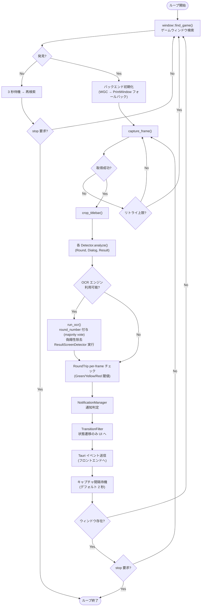

# アプリケーションレイヤー (src-tauri)

> 親ドキュメント: [detection-overview.md](./detection-overview.md)
>
> 関連ドキュメント:
>
> - [Capture レイヤー](./capture.md)
> - [RoundDetector](./round-detector.md)

## 1.1 背景

DNA Assistant のアプリケーションレイヤー(`src-tauri`)は、`dna-capture` と `dna-detector` を統合し、ゲーム画面の監視 → 検出 → 通知の一連のパイプラインを駆動する。Tauri v2 デスクトップアプリとして、IPC コマンド経由でフロントエンドと通信し、Windows Toast 通知でユーザーにアラートを送信する。

問題点:

- キャプチャ(2 秒間隔)と検出処理は UI スレッドをブロックしてはならない
- 複数の Detector が異なるタイミングでイベントを発生させ、通知の重複・氾濫を防ぐ必要がある
- モニタリング状態(起動中/停止中/エラー)をフロントエンドにリアルタイムで反映する必要がある

目標:

バックグラウンドスレッドでキャプチャ → 検出 → 通知ループを駆動し、Tauri IPC + イベントシステムでフロントエンドと状態を同期する。

## 1.2 モジュール構成

| モジュール     | ファイル          | 責務                                                     | プラットフォーム       |
| -------------- | ----------------- | -------------------------------------------------------- | ---------------------- |
| `commands`     | `commands.rs`     | IPC コマンドハンドラ(start/stop/status/preview/settings) | `cfg(windows)`         |
| `monitor`      | `monitor.rs`      | キャプチャ → 検出 → OCR → 通知のバックグラウンドループ   | `cfg(windows)`         |
| `notification` | `notification.rs` | Toast 通知の送信・重複制御                               | `cfg(windows)`         |
| `settings`     | `settings.rs`     | 設定の永続化(JSON ファイルへの読み書き)                  | `cfg(windows)`         |
| `metrics`      | `metrics.rs`      | OTel 計装 — `AppMetrics` グローバルシングルトン          | `cfg(windows)`         |
| `telemetry`    | `telemetry.rs`    | tracing/OTel 初期化・プロセスレベルメトリクス登録        | クロスプラットフォーム |

Linux では `MonitorState` が空のスタブ構造体としてコンパイルされ、ワークスペース全体の `cargo check` が可能。

## 1.3 モニターループ

### 状態遷移

```mermaid
statechart-v2
    [*] --> Idle
    Idle --> SearchingWindow: start_monitoring
    SearchingWindow --> Capturing: ウィンドウ発見
    SearchingWindow --> Idle: stop_monitoring
    Capturing --> SearchingWindow: ウィンドウ消失
    Capturing --> Idle: stop_monitoring
```

### ループ処理フロー



### スレッドモデル

| スレッド         | 役割                                          |
| ---------------- | --------------------------------------------- |
| メインスレッド   | Tauri イベントループ、IPC コマンドハンドラ    |
| モニタースレッド | キャプチャ → 検出 → 通知ループ(`std::thread`) |

モニタースレッドの制御は `Arc<AtomicBool>` の停止フラグで行う。`start_monitoring` でスレッドを起動し、`stop_monitoring` でフラグを立ててスレッド終了を待機する。

## 1.4 IPC コマンド

### `start_monitoring`

モニターループを開始する。既に起動中の場合はエラーを返す。

```rust
#[tauri::command]
async fn start_monitoring(app_handle: AppHandle, state: State<'_, MonitorState>) -> Result<(), String>;
```

### `stop_monitoring`

モニターループを停止する。未起動の場合は何もしない。

```rust
#[tauri::command]
async fn stop_monitoring(app_handle: AppHandle, state: State<'_, MonitorState>) -> Result<(), String>;
```

### `get_status`

現在のモニタリング状態を返す。

```rust
#[tauri::command]
fn get_status(state: State<'_, MonitorState>) -> MonitorStatus;
```

`MonitorStatus` の型定義はセクション 1.8 を参照。

### `get_capture_preview`

最新のキャプチャフレームを base64 エンコード PNG + メタデータとして返す。プレビュー用に最大幅 640px にダウンスケールする。

```rust
#[tauri::command]
fn get_capture_preview(state: State<'_, MonitorState>) -> CapturePreview;
```

```rust
#[derive(Debug, Clone, Serialize)]
pub struct CapturePreview {
    /// Base64-encoded PNG image data.
    pub image_base64: Option<String>,
    /// Capture metadata.
    pub info: CaptureInfo,
}
```

### `get_settings`

現在のモニター設定を返す。

```rust
#[tauri::command]
fn get_settings(state: State<'_, MonitorState>) -> MonitorConfig;
```

### `save_settings`

モニター設定を更新し、ディスクに永続化する。

```rust
#[tauri::command]
async fn save_settings(app_handle: AppHandle, state: State<'_, MonitorState>, config: MonitorConfig) -> Result<(), String>;
```

### `greet`(既存)

接続テスト用コマンド。

## 1.5 Tauri イベント

バックエンドからフロントエンドへの状態通知には Tauri のイベントシステムを使用する。

| イベント名        | ペイロード                         | タイミング         |
| ----------------- | ---------------------------------- | ------------------ |
| `monitor-status`  | `MonitorStatus` (JSON)             | 状態変化時         |
| `detection-event` | `{ kind: string, detail: string }` | 検出イベント発生時 |

フロントエンドは `listen()` でイベントを購読し、リアルタイムに UI を更新する。

## 1.6 通知判定ロジック

### 通知トリガー条件

detection-overview.md セクション 1.6 で定義されたトリガーを実装する。

| トリガー              | 条件                               | 持続時間 | クールダウン | 優先度 | 通知タイトル        |
| --------------------- | ---------------------------------- | -------- | ------------ | ------ | ------------------- |
| ダイアログ表示        | `DialogVisible` が持続             | 3 秒     | 60 秒        | 高     | "ダイアログ検出"    |
| ラウンド完了          | `RoundGone` が持続                 | 5 秒     | 10 秒        | 中     | "ラウンド完了"      |
| 依頼完了(OCR)         | `ResultScreenVisible` 確定         | 0 秒     | 10 秒        | 中     | "依頼完了"          |
| RoundTrip Green 超過  | RoundTrip 経過 >= Green 閾値       | 0 秒     | 10 秒        | 中     | "RoundTrip: Green"  |
| RoundTrip Yellow 超過 | RoundTrip 経過 >= Yellow 閾値      | 0 秒     | 10 秒        | 高     | "RoundTrip: Yellow" |
| RoundTrip Red 超過    | RoundTrip 経過 >= Red 閾値         | 0 秒     | 10 秒        | 高     | "RoundTrip: Red"    |
| キャプチャ停止        | キャプチャ失敗が sustain 時間持続  | 5 秒     | 60 秒        | 高     | "キャプチャ停止"    |
| キャプチャ復帰        | キャプチャ停止後にフレーム取得成功 | —        | —            | 中     | "キャプチャ復帰"    |

繰り返し通知(RoundTrip 最高レベル、キャプチャ停止)は `notification_max_repeat` (デフォルト 5) 回まで送信する。`notify_result_screen()` は `TransitionFilter` による確定後に呼び出される。キャプチャ停止/復帰は Discord ON でも常に Windows Toast + Discord の両方に送信する。

### 通知重複制御

同一トリガーの通知はトリガーごとのクールダウン期間(デフォルト 60 秒、ラウンド系は 10 秒)再送信しない。

### 持続時間判定

```
Detector → [OCR 補正] → NotificationManager(持続時間判定) → Toast
                       → TransitionFilter(状態遷移抽出) → UI イベント
```

`NotificationManager` は各トリガーの条件開始時刻を保持し、持続時間を超えた場合のみ通知を送信する。否定状態(`RoundGone`)は、対応する肯定状態(`RoundVisible`)が最初に観測されるまで通知を抑制する(ロビー画面等での偽通知防止)。

## 1.7 フロントエンド UI

### 画面構成

420x640 ピクセルのシングルウィンドウ。DaisyUI (dark theme) を使用。

```
┌────────────────────────────┐
│  DNA Assistant             │
├────────────────────────────┤
│  [Status Card]             │
│  状態: ○ Idle / Capturing  │
│  Frames: 0   Events: 0    │
├────────────────────────────┤
│  [Control Card]            │
│  [ Start Monitoring ]      │
│  [ Stop Monitoring  ]      │
├────────────────────────────┤
│  [Event Log Card]          │
│  12:34:56 SkillGreyed      │
│  12:34:50 RoundVisible     │
│  12:34:48 DialogGone       │
│  ...                       │
└────────────────────────────┘
```

### コンポーネント

| コンポーネント | 内容                                                   |
| -------------- | ------------------------------------------------------ |
| Status Card    | 現在の状態バッジ、フレーム数、イベント数               |
| Control Card   | Start / Stop ボタン(状態に応じて有効/無効を切り替え)   |
| Event Log Card | 直近の検出イベントを時系列で表示(最大 50 件、新しい順) |

### IPC 連携

- ボタンクリック時: `invoke("start_monitoring")` / `invoke("stop_monitoring")`
- 初回ロード時: `invoke("get_status")` でステータス取得
- リアルタイム更新: `listen("monitor-status")` / `listen("detection-event")`

## 1.8 Tauri 状態管理

```rust
pub struct MonitorState {
    /// Monitor thread handle + stop flag.
    pub handle: Mutex<Option<MonitorHandle>>,
    /// Shared status for IPC queries.
    pub status: Arc<Mutex<MonitorStatus>>,
    /// Latest captured frame (zero-copy Arc, PNG encoding deferred to IPC).
    pub latest_frame: Arc<Mutex<LatestFrame>>,
    /// Monitor loop configuration (loaded from disk on startup).
    pub config: Arc<Mutex<MonitorConfig>>,
}

struct MonitorHandle {
    stop_flag: Arc<AtomicBool>,
    thread: JoinHandle<()>,
}

pub struct MonitorStatus {
    pub state: MonitoringState,
    pub frames_captured: u64,
    pub events_detected: u64,
    pub last_event: Option<String>,
    pub frame_time_ms: f64,
    pub fps: f64,
}
```

`MonitorState` は `tauri::Builder::manage()` で登録し、各コマンドで `State<'_, MonitorState>` として受け取る。設定は `settings.rs` 経由で JSON ファイルに永続化される。

## 1.9 エラーハンドリング

| 状況                       | 挙動                                             |
| -------------------------- | ------------------------------------------------ |
| ゲームウィンドウ未検出     | `SearchingWindow` 状態で 3 秒間隔で再検索        |
| キャプチャバックエンド失敗 | WGC → PrintWindow フォールバック後、再検索に移行 |
| 検出処理例外               | ログ出力、次フレームで継続                       |
| 通知送信失敗               | ログ出力、次のトリガーで再試行                   |
| モニター二重起動           | `start_monitoring` がエラーを返す                |

## 1.10 検討事項

- [x] Phase 2 OCR 検出との統合 — `dna-capture::ocr::JapaneseOcrEngine` + `run_ocr()` 実装済み
- [x] 通知判定ロジック — `NotificationManager` + `TransitionFilter` 実装済み
- [x] 検出結果のスクリーンショット保存 — `TRACE` レベル時に `debug-frames/` へ保存
- [x] OTel メトリクス計装 — `metrics.rs` の `AppMetrics` でモニターループ・キャプチャ・OCR・WGC ライフサイクル等を計装。`telemetry.rs` でプロセスレベルメトリクス(`process.memory.*`, `process.cpu.utilization`, `process.uptime`)を `sysinfo` 経由で登録
- [ ] システムトレイアイコン — 最小化時にトレイに格納、状態をアイコンで表示
- [ ] キャプチャ間隔のユーザー設定 UI — 現在はデフォルト 2 秒固定
- [ ] 通知音のカスタマイズ — Windows Toast のオーディオ設定
