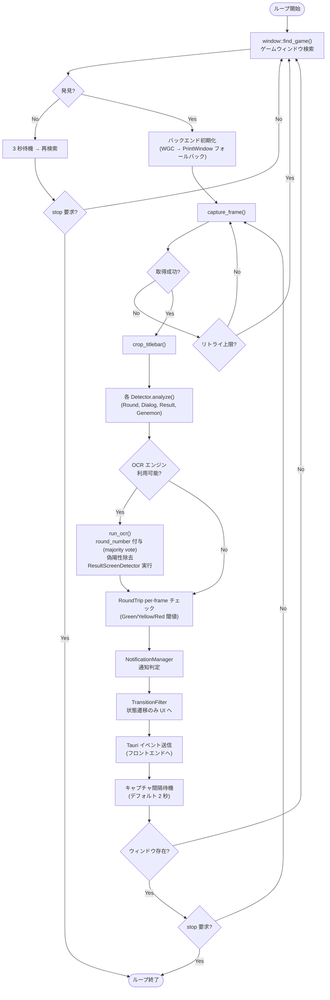

# アプリケーションレイヤー (src-tauri)

> 親ドキュメント: [detection-overview.md](./detection-overview.md)
>
> 関連ドキュメント:
>
> - [Capture レイヤー](./capture.md)
> - [RoundDetector](./round-detector.md)
> - [Notifications](./notifications.md)

## 1.1 背景

DNA Assistant のアプリケーションレイヤー(`src-tauri`)は、`dna-capture` と `dna-detector` を統合し、ゲーム画面の監視 → 検出 → 通知の一連のパイプラインを駆動する。Tauri v2 デスクトップアプリとして、IPC コマンド経由でフロントエンドと通信し、Windows Toast 通知でユーザーにアラートを送信する。

問題点:

- キャプチャ(2 秒間隔)と検出処理は UI スレッドをブロックしてはならない
- 複数の Detector が異なるタイミングでイベントを発生させ、通知の重複・氾濫を防ぐ必要がある
- モニタリング状態(起動中/停止中/エラー)をフロントエンドにリアルタイムで反映する必要がある

目標:

バックグラウンドスレッドでキャプチャ → 検出 → 通知ループを駆動し、Tauri IPC + イベントシステムでフロントエンドと状態を同期する。

## 1.2 モジュール構成

| モジュール               | ファイル                   | 責務                                                                  | プラットフォーム       |
| ------------------------ | -------------------------- | --------------------------------------------------------------------- | ---------------------- |
| `commands`               | `commands.rs`              | IPC コマンドハンドラ(start/stop/status/preview/settings)              | `cfg(windows)`         |
| `monitor`                | `monitor.rs`               | キャプチャ → 検出 → OCR → 通知のバックグラウンドループ                | `cfg(windows)`         |
| `notification`           | `notification.rs`          | Toast 通知の送信・重複制御                                            | `cfg(windows)`         |
| `settings`               | `settings.rs`              | 設定の永続化(JSON ファイルへの読み書き)                               | `cfg(windows)`         |
| `telemetry`              | `telemetry/mod.rs`         | tracing/OTel 初期化・ログエクスポーター・プロセスレベルメトリクス登録 | クロスプラットフォーム |
| `telemetry::metrics`     | `telemetry/metrics.rs`     | OTel 計装 — `AppMetrics` グローバルシングルトン                       | `cfg(windows)`         |
| `telemetry::conventions` | `telemetry/conventions.rs` | `dna.*` メトリクス名・属性キー定数                                    | `cfg(otel)`            |

Linux では `MonitorState` が空のスタブ構造体としてコンパイルされ、ワークスペース全体の `cargo check` が可能。

## 1.3 モニターループ

### 状態遷移

```mermaid
statechart-v2
    [*] --> Idle
    Idle --> SearchingWindow: start_monitoring
    SearchingWindow --> Capturing: ウィンドウ発見
    SearchingWindow --> Idle: stop_monitoring
    Capturing --> SearchingWindow: ウィンドウ消失
    Capturing --> Idle: stop_monitoring
```

### ループ処理フロー


```mermaid
flowchart TD
    START([ループ開始]) --> FIND["window::find_game()\nゲームウィンドウ検索"]
    FIND --> FOUND{"発見?"}
    FOUND -- No --> WAIT_FIND["3 秒待機 → 再検索"]
    WAIT_FIND --> STOP_CHECK_1{"stop 要求?"}
    STOP_CHECK_1 -- Yes --> EXIT([ループ終了])
    STOP_CHECK_1 -- No --> FIND
    FOUND -- Yes --> BACKEND["バックエンド初期化\n(WGC → PrintWindow フォールバック)"]
    BACKEND --> CAPTURE["capture_frame()"]
    CAPTURE --> SUCCESS{"取得成功?"}
    SUCCESS -- No --> RETRY{"リトライ上限?"}
    RETRY -- No --> CAPTURE
    RETRY -- Yes --> FIND
    SUCCESS -- Yes --> TITLEBAR["crop_titlebar()"]
    TITLEBAR --> DETECT["各 Detector.analyze()\n(Round, Dialog, Result, Genemon)"]
    DETECT --> OCR{"OCR エンジン\n利用可能?"}
    OCR -- Yes --> OCR_RUN["run_ocr()\nround_number 付与 (majority vote)\n偽陽性除去\nResultScreenDetector 実行"]
    OCR -- No --> ROUNDTRIP["RoundTrip per-frame チェック\n(Green/Yellow/Red 閾値)"]
    OCR_RUN --> ROUNDTRIP
    ROUNDTRIP --> NOTIFY["NotificationManager\n通知判定"]
    NOTIFY --> TRANSITION["TransitionFilter\n状態遷移のみ UI へ"]
    TRANSITION --> EMIT["Tauri イベント送信\n(フロントエンドへ)"]
    EMIT --> INTERVAL["キャプチャ間隔待機\n(デフォルト 2 秒)"]
    INTERVAL --> ALIVE{"ウィンドウ存在?"}
    ALIVE -- Yes --> STOP_CHECK_2{"stop 要求?"}
    ALIVE -- No --> FIND
    STOP_CHECK_2 -- Yes --> EXIT
    STOP_CHECK_2 -- No --> CAPTURE
```

### スレッドモデル

| スレッド         | 役割                                          |
| ---------------- | --------------------------------------------- |
| メインスレッド   | Tauri イベントループ、IPC コマンドハンドラ    |
| モニタースレッド | キャプチャ → 検出 → 通知ループ(`std::thread`) |

モニタースレッドの制御は `Arc<AtomicBool>` のフラグで行う。停止フラグ (`stop_flag`) と リセット要求フラグ (`reset_requested`) の 2 本を使用する。`start_monitoring` でスレッドを起動し、`stop_monitoring` でフラグを立ててスレッド終了を待機する。`reset_round` は `reset_requested` を立て、次のティックで状態をクリアする。

## 1.4 IPC コマンド

### `start_monitoring`

モニターループを開始する。既に起動中の場合はエラーを返す。

```rust
#[tauri::command]
async fn start_monitoring(app_handle: AppHandle, state: State<'_, MonitorState>) -> Result<(), String>;
```

### `stop_monitoring`

モニターループを停止する。未起動の場合は何もしない。

```rust
#[tauri::command]
async fn stop_monitoring(app_handle: AppHandle, state: State<'_, MonitorState>) -> Result<(), String>;
```

### `get_status`

現在のモニタリング状態を返す。

```rust
#[tauri::command]
fn get_status(state: State<'_, MonitorState>) -> MonitorStatus;
```

`MonitorStatus` の型定義はセクション 1.8 を参照。

### `get_capture_preview`

最新のキャプチャフレームを base64 エンコード PNG + メタデータとして返す。プレビュー用に最大幅 640px にダウンスケールする。

```rust
#[tauri::command]
fn get_capture_preview(state: State<'_, MonitorState>) -> CapturePreview;
```

```rust
#[derive(Debug, Clone, Serialize)]
pub struct CapturePreview {
    /// Base64-encoded PNG image data.
    pub image_base64: Option<String>,
    /// Capture metadata.
    pub info: CaptureInfo,
}
```

### `get_settings`

現在のモニター設定を返す。

```rust
#[tauri::command]
fn get_settings(state: State<'_, MonitorState>) -> MonitorConfig;
```

### `save_settings`

モニター設定を更新し、ディスクに永続化する。

```rust
#[tauri::command]
async fn save_settings(app_handle: AppHandle, state: State<'_, MonitorState>, config: MonitorConfig) -> Result<(), String>;
```

### `get_app_version`

アプリケーションのバージョン文字列(例: `"0.1.8"`)を返す。起動時にフロントエンドがサイドバーに表示するために使用する。

```rust
#[tauri::command]
pub fn get_app_version(app: tauri::AppHandle) -> String;
```

### `reset_round`

モニターループに `reset_requested` フラグを立て、次のティックで全ラウンド状態をクリアさせる。モニタリング停止中は何もしない(フラグは次回起動時に消費される)。

```rust
#[tauri::command]
pub fn reset_round(state: State<'_, MonitorState>);
```

リセット対象: `current_round`, `round_start`, `result_idle_start`, `result_scanning`, `result_visible_confirmed`, `select_round_votes`, `round_history`, `NotificationManager` 全体。完了後に `round-reset` イベントを emit する。

### `greet`(既存)

接続テスト用コマンド。

## 1.5 Tauri イベント

バックエンドからフロントエンドへの状態通知には Tauri のイベントシステムを使用する。

| イベント名        | ペイロード                     | タイミング                     |
| ----------------- | ------------------------------ | ------------------------------ |
| `monitor-status`  | `MonitorStatus` (JSON)         | 状態変化時                     |
| `detection-event` | `DetectionEventPayload` (JSON) | 検出イベント発生時             |
| `round-reset`     | `()` (empty)                   | `reset_round` IPC 処理完了直後 |

フロントエンドは `listen()` でイベントを購読し、リアルタイムに UI を更新する。

### `DetectionEventPayload` スキーマ

```typescript
{
  kind: string;          // イベント種別 (下表)
  detail: string;        // 人間可読な説明
  round_number?: number; // 現在のラウンド番号 (OCR 確定済み)
  elapsed_secs?: number; // ラウンド経過秒数
  elapsed?: string;      // ラウンド経過時間 (表示用文字列, 例: "1:23")
  stage_kind?: string;   // ステージ種別ラベル ("探検" / "ガード")
}
```

| `kind` 値             | 送信タイミング                                                         |
| --------------------- | ---------------------------------------------------------------------- |
| `RoundVisible`        | `TransitionFilter` がラウンド開始を確定                                |
| `RoundGone`           | `TransitionFilter` がラウンド終了を確定                                |
| `StageKindUpdate`     | `RoundVisible` 確定後のリトライ OCR でステージ種別が初めて確定したとき |
| `DialogVisible`       | ダイアログ検出                                                         |
| `DialogGone`          | ダイアログ消失                                                         |
| `ResultScreenVisible` | リザルト画面検出                                                       |
| `ResultScreenGone`    | リザルト画面消失                                                       |
| `SkillGreyed`         | スキルグレーアウト検出                                                 |
| `GenemonVisible`      | ジェネモン検出                                                         |

### ステージ種別リトライ

`RoundVisible` 確定フレームで `stage_kind` が `Unknown` だった場合、`stage_kind_scan_deadline`(確定から 5 秒後)を設定し、以降のフレームごとに OCR を再試行する。`Unknown` 以外の種別が検出された時点で `StageKindUpdate` イベントを送信しデッドラインをクリアする。`RoundGone` でもデッドラインをクリアする。

## 1.6 通知判定ロジック

### 通知トリガー条件

detection-overview.md セクション 1.6 で定義されたトリガーを実装する。

| トリガー              | 条件                                                   | 持続時間 | クールダウン                   | 優先度 | 通知タイトル        |
| --------------------- | ------------------------------------------------------ | -------- | ------------------------------ | ------ | ------------------- |
| ダイアログ表示        | `DialogVisible` が持続                                 | 3 秒     | 60 秒                          | 高     | "ダイアログ検出"    |
| ラウンド完了          | `RoundGone` が持続                                     | 5 秒     | 10 秒                          | 中     | "ラウンド完了"      |
| 依頼完了(OCR)         | `ResultScreenVisible` 確定                             | 0 秒     | 10 秒                          | 中     | "依頼完了"          |
| リザルト放置          | `ResultScreenVisible` 確定後に `RoundVisible` が来ない | 0 秒     | `notify_result_idle_threshold` | 中     | "リザルト放置中"    |
| ジェネモン発見        | `GenemonVisible`                                       | 0 秒     | `notification_cooldown`        | 中     | "ジェネモン発見"    |
| RoundTrip Green 超過  | RoundTrip 経過 >= Green 閾値                           | 0 秒     | 10 秒                          | 中     | "RoundTrip: Green"  |
| RoundTrip Yellow 超過 | RoundTrip 経過 >= Yellow 閾値                          | 0 秒     | 10 秒                          | 高     | "RoundTrip: Yellow" |
| RoundTrip Red 超過    | RoundTrip 経過 >= Red 閾値                             | 0 秒     | 10 秒                          | 高     | "RoundTrip: Red"    |
| キャプチャ停止        | キャプチャ失敗が sustain 時間持続                      | 5 秒     | 60 秒                          | 高     | "キャプチャ停止"    |
| キャプチャ復帰        | キャプチャ停止後にフレーム取得成功                     | —        | —                              | 中     | "キャプチャ復帰"    |

繰り返し通知(RoundTrip 最高レベル、キャプチャ停止、リザルト放置)は `notification_max_repeat` (デフォルト 5) 回まで送信する。`notify_result_screen()` は `TransitionFilter` による確定後に呼び出される。キャプチャ停止/復帰は `desktop_enabled`/`discord_enabled` の独立ディスパッチに従う。

リザルト放置通知 (`ResultIdle`) は `ResultScreenVisible` 確定時に `result_idle_start` タイマーを開始し、`RoundVisible` または `ResultScreenGone` で `reset_result_idle()` を呼びリセットする。繰り返し間隔 = `notify_result_idle_threshold`。詳細は [notifications.md](./notifications.md) を参照。

### 通知重複制御

同一トリガーの通知はトリガーごとのクールダウン期間(デフォルト 60 秒、ラウンド系は 10 秒)再送信しない。

### 持続時間判定

```
Detector → [OCR 補正] → NotificationManager(持続時間判定) → Toast
                       → TransitionFilter(状態遷移抽出) → UI イベント
```

`NotificationManager` は各トリガーの条件開始時刻を保持し、持続時間を超えた場合のみ通知を送信する。否定状態(`RoundGone`)は、対応する肯定状態(`RoundVisible`)が最初に観測されるまで通知を抑制する(ロビー画面等での偽通知防止)。

## 1.7 フロントエンド UI

### 画面構成

420x640 ピクセルのシングルウィンドウ。DaisyUI (dark theme) を使用。

```
┌────────────────────────────┐
│  DNA Assistant             │
├────────────────────────────┤
│  [Status Card]             │
│  状態: ○ Idle / Capturing  │
│  Frames: 0   Events: 0    │
├────────────────────────────┤
│  [Control Card]            │
│  [ Start Monitoring ]      │
│  [ Stop Monitoring  ]      │
├────────────────────────────┤
│  [Event Log Card]          │
│  T12:34:56 SkillGreyed     │
│  T12:34:50 RoundVisible    │
│  T12:34:48 DialogGone      │
│  ...                       │
└────────────────────────────┘
```

### コンポーネント

| コンポーネント | 内容                                                             |
| -------------- | ---------------------------------------------------------------- |
| Status Card    | 現在の状態バッジ、フレーム数、イベント数                         |
| Control Card   | Start / Stop / Reset ボタン(Start・Stop は状態に応じて有効/無効) |
| Event Log Card | 直近の検出イベントを時系列で表示(最大 50 件、新しい順)           |

サイドバー下部に Desktop (toast) と Discord の通知チャンネルトグルを配置。独立して ON/OFF でき、変更時は即座に `save_settings` を呼ぶ。

### IPC 連携

- ボタンクリック時: `invoke("start_monitoring")` / `invoke("stop_monitoring")` / `invoke("reset_round")`
- 初回ロード時: `invoke("get_status")` でステータス取得、`invoke("get_app_version")` でバージョン取得(サイドバーに表示)
- リアルタイム更新: `listen("monitor-status")` / `listen("detection-event")` / `listen("round-reset")`
- `round-reset` 受信時: ラウンドトリップタイマーバッジを `--` にリセット

## 1.8 Tauri 状態管理

```rust
pub struct MonitorState {
    /// Monitor thread handle + stop flag.
    pub handle: Mutex<Option<MonitorHandle>>,
    /// Shared status for IPC queries.
    pub status: Arc<Mutex<MonitorStatus>>,
    /// Latest captured frame (zero-copy Arc, PNG encoding deferred to IPC).
    pub latest_frame: Arc<Mutex<LatestFrame>>,
    /// Monitor loop configuration (loaded from disk on startup).
    pub config: Arc<Mutex<MonitorConfig>>,
    /// Set to `true` by `reset_round` IPC; the monitor loop clears it and resets state.
    pub reset_requested: Arc<AtomicBool>,
}

struct MonitorHandle {
    stop_flag: Arc<AtomicBool>,
    thread: JoinHandle<()>,
}

pub struct MonitorStatus {
    pub state: MonitoringState,
    pub frames_captured: u64,
    pub events_detected: u64,
    pub last_event: Option<String>,
    pub frame_time_ms: f64,
    pub fps: f64,
}
```

`MonitorState` は `tauri::Builder::manage()` で登録し、各コマンドで `State<'_, MonitorState>` として受け取る。設定は `settings.rs` 経由で JSON ファイルに永続化される。

## 1.9 エラーハンドリング

| 状況                       | 挙動                                             |
| -------------------------- | ------------------------------------------------ |
| ゲームウィンドウ未検出     | `SearchingWindow` 状態で 3 秒間隔で再検索        |
| キャプチャバックエンド失敗 | WGC → PrintWindow フォールバック後、再検索に移行 |
| 検出処理例外               | ログ出力、次フレームで継続                       |
| 通知送信失敗               | ログ出力、次のトリガーで再試行                   |
| モニター二重起動           | `start_monitoring` がエラーを返す                |

## 1.10 検討事項

- [x] Phase 2 OCR 検出との統合 — `dna-capture::ocr::JapaneseOcrEngine` + `run_ocr()` 実装済み
- [x] 通知判定ロジック — `NotificationManager` + `TransitionFilter` 実装済み
- [x] 検出結果のスクリーンショット保存 — `TRACE` レベル時に `debug-frames/` へ保存
- [x] OTel メトリクス計装 — `telemetry/metrics.rs` の `AppMetrics` でモニターループ・キャプチャ・OCR・WGC ライフサイクル等を計装。`telemetry/mod.rs` でプロセスレベルメトリクス(`process.memory.*`, `process.cpu.utilization`, `process.uptime`)を `sysinfo` 経由で登録。`telemetry/conventions.rs` で `dna.*` メトリクス名・属性キーを定数として一元管理
- [x] OTel ログエクスポーター — `OpenTelemetryTracingBridge` (`opentelemetry-appender-tracing`) を `telemetry/mod.rs` に追加。tracing ログを OTel logs シグナルとして OTLP エクスポート。シャットダウン順序はトレーサー → メーター → ロガーの順で制御
- [x] リザルト放置通知 — `TriggerKind::ResultIdle` + `notify_result_idle()` / `reset_result_idle()`。閾値秒数は `notify_result_idle_threshold` (デフォルト 50 秒)、ON/OFF は `notify_result_idle_enabled`
- [x] ラウンドリセットボタン — `reset_round` IPC コマンド + `reset_requested: Arc<AtomicBool>` フラグ。モニタリング中でも全ラウンド状態をクリア可能
- [x] Desktop 通知チャンネル制御 — `desktop_enabled` (デフォルト `true`) で Windows Toast の ON/OFF を独立制御。Discord と直交する設計。詳細は [notifications.md](./notifications.md)
- [ ] システムトレイアイコン — 最小化時にトレイに格納、状態をアイコンで表示
- [ ] キャプチャ間隔のユーザー設定 UI — 現在はデフォルト 2 秒固定
- [ ] 通知音のカスタマイズ — Windows Toast のオーディオ設定
