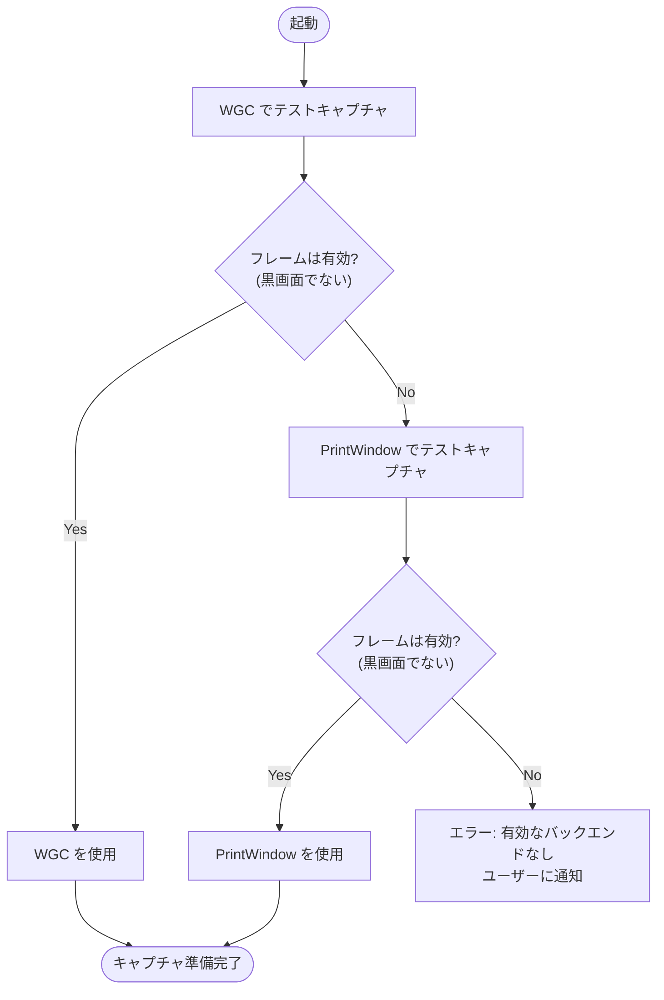
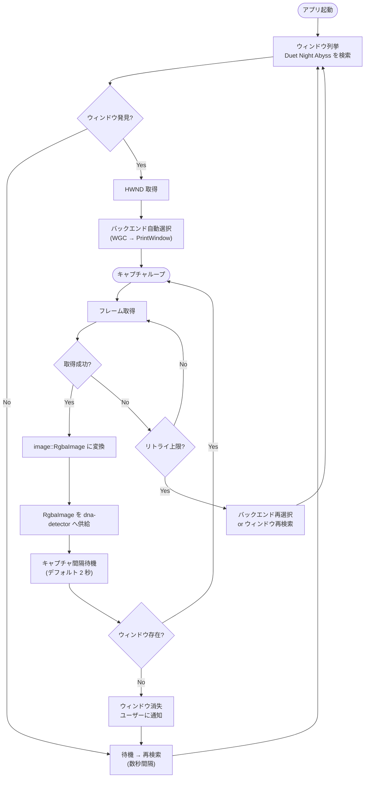
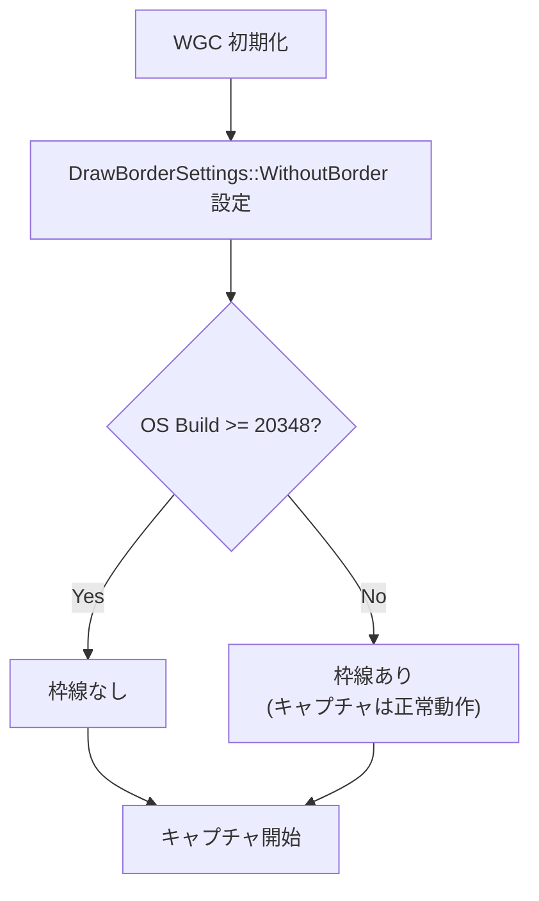

# Capture レイヤー (dna-capture)

> 親ドキュメント: [detection-overview.md](./detection-overview.md)
>
> 関連ドキュメント:
>
> - [RoundDetector](./round-detector.md)

## 1.1 背景

DNA Assistant はゲームウィンドウ "Duet Night Abyss" の画面を定期的にキャプチャし、`image::RgbaImage` として `dna-detector` クレートへ供給する。キャプチャ処理は `dna-capture` クレート(`crates/dna-capture/`)が担当し、Windows 専用の画面取得 API をラップする。

問題点:

- ゲームウィンドウは他ウィンドウの裏に配置される運用のため、通常の `BitBlt` では 3D アクセラレーション描画を取得できない
- キャプチャ方式によっては黒画面を返す場合があり、自動フォールバックが必要
- WGC はデフォルトでキャプチャ対象ウィンドウに黄色い枠線を表示するため、無効化が必要
- `dna-capture` は Windows 専用だが、ワークスペース全体の `cargo check` / `cargo clippy` を DevContainer (Linux) でも実行可能にする必要がある

目標:

WGC をプライマリ、`PrintWindow` をフォールバックとする 2 段構成で、バックグラウンドウィンドウから安定的にフレームを取得し、`image::RgbaImage` を `dna-detector` へ供給する。

## 1.2 キャプチャバックエンド

### WGC (Windows Graphics Capture API) — プライマリ

| 項目             | 内容                                                             |
| ---------------- | ---------------------------------------------------------------- |
| ラッパー         | `windows-capture` クレート                                       |
| API              | `IGraphicsCaptureItemInterop::CreateForWindow` (HWND 指定)       |
| GPU アクセス     | DWM 合成後のテクスチャを GPU 上で共有                            |
| バックグラウンド | 他ウィンドウに隠れた(occluded)ウィンドウでも正常にキャプチャ可能 |
| 最小要件         | Windows 10 1903+ (Build 18362)                                   |
| 枠線制御         | `DrawBorderSettings::WithoutBorder` で黄色枠線を無効化           |
| 枠線無効化要件   | Windows 10 Build 20348+ / Windows 11                             |
| コールバック     | フレーム更新時のみ発火(変化がない場合の CPU 負荷はほぼゼロ)      |

### PrintWindow API — フォールバック

| 項目             | 内容                                                             |
| ---------------- | ---------------------------------------------------------------- |
| ラッパー         | `win-screenshot` クレート                                        |
| API              | `PrintWindow` + `PW_RENDERFULLCONTENT` フラグ                    |
| 最小要件         | Windows 8.1+                                                     |
| バックグラウンド | 隠れたウィンドウでもコンテンツをレンダリング可能                 |
| 制限             | DirectX ゲームでは黒画面を返す場合がある(ゲームの描画方式に依存) |

### バックエンド自動選択ロジック

起動時にテストキャプチャを実行し、有効なバックエンドを自動選択する。



黒画面判定: フレーム全体のピクセル平均輝度が閾値以下の場合、黒画面と判定する。

## 1.3 ウィンドウ列挙・ターゲット選択

| 項目           | 内容                                                             |
| -------------- | ---------------------------------------------------------------- |
| 検索方法       | ウィンドウタイトルに `"Duet Night Abyss"` を含むウィンドウを検索 |
| WGC API        | `Window::from_contains_name("Duet Night Abyss")`                 |
| Win32 API      | `EnumWindows` + `GetWindowTextW` で HWND を取得                  |
| HWND 管理      | ターゲット HWND を保持し、ウィンドウ消失時に再検索               |
| 複数ウィンドウ | 最初に見つかったウィンドウを使用(複数インスタンスは非対応)       |

## 1.4 フレーム仕様

| 項目         | 内容                                                                                                                                   |
| ------------ | -------------------------------------------------------------------------------------------------------------------------------------- |
| 出力型       | `image::RgbaImage`                                                                                                                     |
| タイトルバー | ゲームアップデート後はフレームに含まない。プリアップデート版では含む(除去は `dna-detector` の `titlebar::crop_titlebar()` が担当)      |
| 解像度       | ゲームウィンドウサイズ依存(ポストアップデート: FHD `1920x1080`、1600x900 `1600x900` 等 / プリアップデート: `1922x1112`、`1602x932` 等) |
| ピクセル形式 | RGBA 8bit/channel (WGC / PrintWindow はネイティブ BGRA — 変換が必要)                                                                   |
| 下限解像度   | 約 `960x540` (qHD) — これ以下では `dna-detector` 側のテキスト検出が不安定                                                              |

### タイトルバーの責務分離

`dna-capture` はウィンドウ全体(タイトルバー含む)をそのまま返す。タイトルバーの検出・除去は `dna-detector` の `titlebar` モジュールが担当する。

```
dna-capture                          dna-detector
┌─────────────┐                      ┌──────────────────┐
│ WGC /       │  image::RgbaImage    │ crop_titlebar()  │
│ PrintWindow │ ──────────────────►  │ (タイトルバー除去) │
│             │  (タイトルバー含む)   │       │          │
└─────────────┘                      │       ▼          │
                                     │ 各 Detector      │
                                     │ .analyze()       │
                                     └──────────────────┘
```

## 1.5 キャプチャ間隔

| 項目             | 値                 | 説明                             |
| ---------------- | ------------------ | -------------------------------- |
| 通常間隔         | `2` 秒             | CPU 負荷を抑えつつ十分な検出速度 |
| 調整範囲         | `1` - `5` 秒       | ユーザー設定で調整可能           |
| WGC コールバック | フレーム更新時のみ | 変化がない場合の負荷はほぼゼロ   |
| PrintWindow      | タイマーベース     | 設定間隔ごとにポーリング         |

## 1.6 処理フロー



## 1.7 エラーハンドリング

### キャプチャ失敗時のリトライ

| 状況                   | 挙動                                           |
| ---------------------- | ---------------------------------------------- |
| 一時的なキャプチャ失敗 | 数回リトライ後、次のキャプチャ間隔まで待機     |
| 連続失敗(閾値超過)     | バックエンドを切り替えて再試行                 |
| 全バックエンド失敗     | ユーザーに通知し、ウィンドウ再検索モードへ移行 |

### ウィンドウ消失時

| 状況         | 挙動                                               |
| ------------ | -------------------------------------------------- |
| ゲーム終了   | キャプチャループを停止し、ウィンドウ再検索モードへ |
| ゲーム再起動 | 新しいウィンドウを検出してキャプチャを再開         |
| HWND 無効化  | Win32 `IsWindow()` で検出し、再検索へ              |

### WGC 黄色枠線の無効化

`DrawBorderSettings::WithoutBorder` を設定し、キャプチャ対象ウィンドウに表示される黄色い枠線を無効化する。Windows 10 Build 20348 未満では無効化できないが、キャプチャ自体は正常に動作する。



## 1.8 プラットフォームゲーティング

`dna-capture` は Windows 専用クレートだが、DevContainer (Linux) でのワークスペース全体の `cargo check` / `cargo clippy` / `cargo test` を可能にするため、`cfg` ゲーティングで空ライブラリとしてコンパイルする。

```rust
// lib.rs
#[cfg(target_os = "windows")]
pub mod wgc;

#[cfg(target_os = "windows")]
pub mod printwindow;

#[cfg(target_os = "windows")]
pub mod window;

#[cfg(target_os = "windows")]
pub mod ocr;

// Linux では空ライブラリとしてコンパイル
```

### Cargo.toml の条件付き依存

```toml
[target.'cfg(target_os = "windows")'.dependencies]
windows-capture = "1.5"
win-screenshot = "4.0"
windows = { version = "0.62", features = ["Win32_UI_WindowsAndMessaging", "Win32_Foundation"] }
```

## 1.9 依存クレート

| クレート          | バージョン | 用途                                                                      | プラットフォーム       |
| ----------------- | ---------- | ------------------------------------------------------------------------- | ---------------------- |
| `dna-detector`    | path       | `OcrEngine` トレイト実装のため依存                                        | クロスプラットフォーム |
| `windows-capture` | `1.5`      | WGC ラッパー(プライマリキャプチャ)                                        | Windows                |
| `win-screenshot`  | `4.0`      | `PrintWindow` ラッパー(フォールバック)                                    | Windows                |
| `windows`         | `0.62`     | Win32 API (HWND 取得)、OCR (`Windows.Media.Ocr`、`Windows.Globalization`) | Windows                |
| `image`           | workspace  | `RgbaImage` — キャプチャ出力フォーマット                                  | クロスプラットフォーム |
| `anyhow`          | workspace  | エラーハンドリング                                                        | クロスプラットフォーム |
| `tracing`         | workspace  | 構造化ログ                                                                | クロスプラットフォーム |

> 3 クレートすべてが `windows` `0.62.x` に依存しており、ワークスペースで `"0.62"` に統一可能。
> `windows-capture` `2.0.0-alpha` は大規模リライト中のため安定版 `1.5` を使用する。

## 1.10 モジュール構成

| モジュール    | ファイル         | 責務                                                       |
| ------------- | ---------------- | ---------------------------------------------------------- |
| `window`      | `window.rs`      | ウィンドウ列挙、タイトルマッチング、HWND 取得・管理        |
| `wgc`         | `wgc.rs`         | WGC バックエンド実装、`GraphicsCaptureApiHandler`          |
| `printwindow` | `printwindow.rs` | `PrintWindow` フォールバック実装                           |
| `ocr`         | `ocr.rs`         | `JapaneseOcrEngine` — Windows OCR API (日本語テキスト認識) |

全モジュールは `#[cfg(target_os = "windows")]` でゲーティングされる。

## 1.11 API インターフェース

### Capture トレイト

```rust
use anyhow::Result;
use image::RgbaImage;

/// Backend-agnostic screen capture interface.
pub trait Capture {
    /// Capture a single frame from the target window.
    ///
    /// Returns the full window content including the titlebar.
    /// Titlebar removal is handled by `dna-detector::titlebar::crop_titlebar()`.
    ///
    /// # Errors
    ///
    /// Returns an error if the capture fails (e.g., window closed,
    /// API unavailable, or backend-specific failure).
    fn capture_frame(&mut self) -> Result<RgbaImage>;

    /// Check whether the target window still exists.
    fn is_window_alive(&self) -> bool;
}
```

### CaptureBackend enum

```rust
/// Available capture backends.
#[derive(Debug, Clone, Copy, PartialEq, Eq)]
pub enum CaptureBackend {
    /// Windows Graphics Capture API (primary, GPU-accelerated).
    WindowsGraphicsCapture,
    /// PrintWindow API (fallback).
    PrintWindow,
}
```

### wgc::Capturer API

```rust
/// Screen capture backend using the Windows Graphics Capture API.
pub struct Capturer { /* ... */ }

impl Capturer {
    /// Start a new WGC capture session for the given window.
    ///
    /// `on_frame` is called on every captured frame (WGC background thread).
    /// `on_drop` is called once when this Capturer is dropped (caller thread).
    /// Pass `|| {}` for either parameter when no instrumentation is needed.
    pub fn start(
        hwnd: HWND,
        on_frame: impl Fn() + Send + Sync + 'static,
        on_drop: impl Fn() + Send + 'static,
    ) -> Result<Self>;
}

impl Drop for Capturer {
    /// Invokes `on_drop`, then calls `CaptureControl::stop` to join the
    /// WGC background thread.
    fn drop(&mut self);
}
```

`on_frame` はメトリクス計装(WGC フレーム受信カウンタのインクリメント等)に使用する。計装不要の場合は `|| {}` を渡す。`Capturer` が `Drop` されると `on_drop` が呼ばれ、バックグラウンドスレッドが明示的に停止される。

### OCR API

```rust
/// Windows OCR engine wrapper, pre-initialized with Japanese language.
///
/// Create once at monitor startup, reuse across frames.
pub struct JapaneseOcrEngine { /* ... */ }

impl JapaneseOcrEngine {
    /// Create a new OCR engine for Japanese text recognition.
    ///
    /// # Errors
    ///
    /// Returns an error if the Japanese language pack is not installed
    /// or the OCR engine cannot be created.
    pub fn new() -> Result<Self>;

    /// Run OCR on a cropped RGBA image region.
    ///
    /// Returns all recognized text as a single string.
    pub fn recognize_text(&self, image: &RgbaImage) -> Result<String>;
}
```

`JapaneseOcrEngine` は `dna_detector::ocr::OcrEngine` トレイトを実装しており、`ResultScreenDetector` 等の Detector に `&dyn OcrEngine` として注入できる。内部で二値化(閾値 `140`)と RGBA → BGRA 変換を行い、`Windows.Media.Ocr.OcrEngine` へ渡す。OCR 用の ROI 切り出しは呼び出し元(`src-tauri` の `run_ocr()` や `ResultScreenDetector`)が `RoiDefinition::crop()` で行う。

### ウィンドウ検索 API

```rust
use windows::Win32::Foundation::HWND;

/// Find the game window by title.
///
/// # Errors
///
/// Returns an error if no window matching "Duet Night Abyss" is found.
pub fn find_game_window() -> Result<HWND>;
```

## 1.12 テスト戦略

### プラットフォーム制約

`dna-capture` のキャプチャ機能は実際の Windows デスクトップ環境とゲームウィンドウが必要なため、自動テストには制限がある。

| テスト種別         | 実行環境           | 内容                                              |
| ------------------ | ------------------ | ------------------------------------------------- |
| ユニットテスト     | Windows ネイティブ | ウィンドウ列挙ロジック、黒画面判定、設定値検証    |
| インテグレーション | Windows ネイティブ | 実際のウィンドウに対するキャプチャ取得・変換      |
| CI (DevContainer)  | Linux              | `cargo check` / `cargo clippy` のみ(空ライブラリ) |

### CI での扱い

```yaml
# CI: cross-check のみ (DevContainer / Linux)
- name: Check core crates
  run: mise run check:core
  # dna-capture は空ライブラリとしてコンパイルされる

# Windows CI: フルテスト (将来)
- name: Test on Windows
  runs-on: windows-latest
  run: mise run test
```

### モック戦略

`Capture` トレイトを使用することで、`dna-detector` 側のテストではモックキャプチャを注入可能。

```rust
/// Mock capture backend for testing.
struct MockCapture {
    frames: Vec<RgbaImage>,
    index: usize,
}

impl Capture for MockCapture {
    fn capture_frame(&mut self) -> Result<RgbaImage> {
        let frame = self.frames[self.index].clone();
        self.index = (self.index + 1) % self.frames.len();
        Ok(frame)
    }

    fn is_window_alive(&self) -> bool {
        true
    }
}
```

## 1.13 検討事項

- [x] Windows OCR API (`Windows.Media.Ocr`) の統合 — `JapaneseOcrEngine` 実装済み
- [ ] `GetClientRect` によるクライアント領域のみのキャプチャ — タイトルバー除去が不要になるが、`crop_titlebar()` は `0` を返すため無害
- [ ] WGC のフレームプール管理 — メモリ使用量の最適化(フレームバッファのサイズ制御)
- [ ] キャプチャ間隔のアダプティブ調整 — 状態変化が激しい場合に間隔を短縮
- [ ] `PrintWindow` の `PW_RENDERFULLCONTENT` が効かないゲーム環境への対応
- [ ] `windows-capture` / `win-screenshot` / `windows` クレートのバージョン固定 — 実装時に `deps-sync` で最新バージョンを確認し、`Cargo.toml` に反映
- [x] WGC コールバックモデルと定期ポーリングモデルの統合設計 — `Capturer::start` に `on_frame`/`on_drop` コールバックを追加し、メトリクス計装を注入可能にした
- [ ] アンチチートソフトウェアによるキャプチャブロック時のユーザー通知
