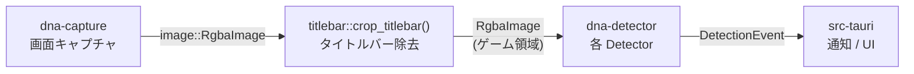
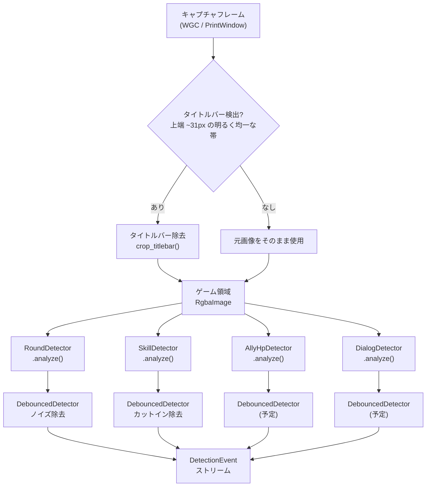
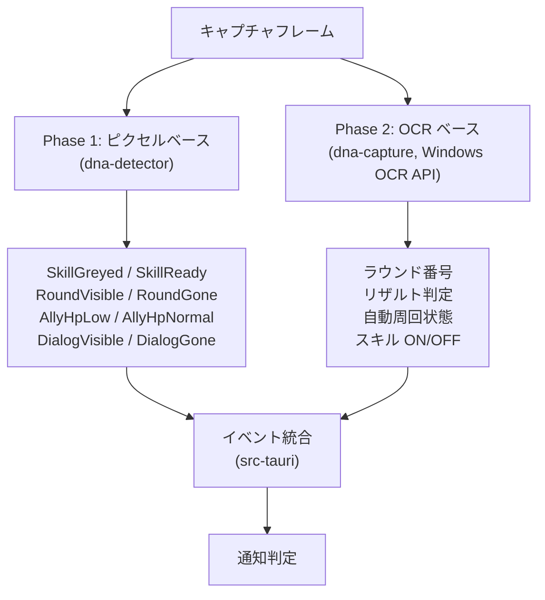
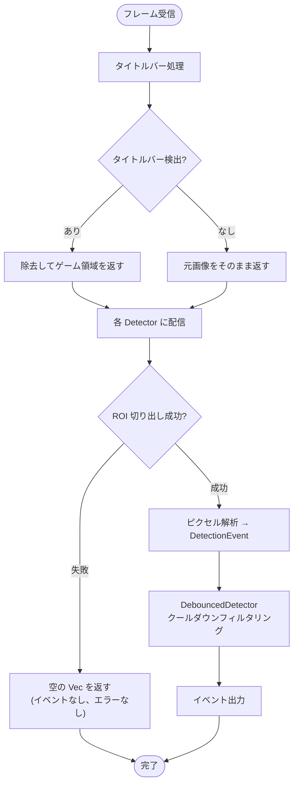

# 検出パイプライン概要

> 関連ドキュメント:
>
> - [RoundDetector](./round-detector.md)
> - [SkillDetector](./skill-detector.md)

## 1.1 背景

DNA Assistant は Duet Night Abyss のゲームプレイを監視し、AFK(放置)中のゲーム状態変化を Windows Toast 通知で報告するデスクトップアプリケーションである。

ゲーム画面のキャプチャフレームを解析し、ラウンド進行、スキル状態、味方 HP などの変化を検出する。検出ロジックはクレート分離により、プラットフォーム依存と非依存の責務を明確に分けている。

問題点:

- ピクセルベース検出は高速だが、テキスト読み取り(ラウンド番号、リザルト判定など)ができない
- Windows OCR API は `dna-capture` クレート(Windows 専用)に依存するため、`dna-detector` からは利用できない
- 検出精度とプラットフォーム移植性のバランスを取る必要がある

目標:

ピクセルベース検出(Phase 1)と OCR ベース検出(Phase 2)の責務分離を明確にし、段階的に検出精度を向上させる。

## 1.2 アーキテクチャ

### クレート構成

| クレート        | パス                   | プラットフォーム       | 責務                                                 |
| --------------- | ---------------------- | ---------------------- | ---------------------------------------------------- |
| `dna-detector`  | `crates/dna-detector/` | クロスプラットフォーム | ピクセルベース検出ロジック(ROI、色空間、各 Detector) |
| `dna-capture`   | `crates/dna-capture/`  | Windows 専用           | 画面キャプチャ(WGC, PrintWindow)、OCR(Phase 2)       |
| `dna-assistant` | `src-tauri/`           | Windows 専用           | Tauri v2 アプリ(IPC、通知、トレイ)                   |

### データフロー



### モジュール構成(`dna-detector`)

| モジュール          | 責務                                                       |
| ------------------- | ---------------------------------------------------------- |
| `detector::round`   | `RoundDetector` — ラウンドテキスト有無の検出               |
| `detector::skill`   | `SkillDetector` — Q スキル SP 枯渇の検出                   |
| `detector::ally_hp` | `AllyHpDetector` — 味方 HP 監視(スキャフォールディング)    |
| `detector::dialog`  | `DialogDetector` — ダイアログボックス(通信エラー等)の検出  |
| `state`             | `DebouncedDetector` — 一過性状態変化の抑制ラッパー         |
| `config`            | `DetectionConfig` — 全 Detector の設定型                   |
| `event`             | `DetectionEvent` — 検出イベント enum                       |
| `roi`               | `RoiDefinition` / `PixelRect` — 比率ベース ROI             |
| `color`             | `Hsv` / `HsvRange` / `rgb_to_hsv()` — 色空間ユーティリティ |
| `titlebar`          | `crop_titlebar()` — タイトルバー検出・除去                 |

## 1.3 検出パイプライン

### フレーム前処理

全ての Detector に共通する前処理として、タイトルバーの除去を行う。



### Detector 共通インターフェース

```rust
/// Trait for frame analyzers that produce detection events.
pub trait Detector {
    /// Analyze a single frame and return any detected events.
    fn analyze(&self, frame: &RgbaImage) -> Vec<DetectionEvent>;
}
```

全 Detector は `Detector` トレイトを実装し、`RgbaImage`(ゲーム領域)を入力、`Vec<DetectionEvent>` を出力とする。ROI の切り出しは各 Detector が `RoiDefinition::crop()` を使用して内部で行う。

### ROI(Region of Interest)

ROI は比率ベース(`0.0..=1.0`)で定義され、任意の解像度に自動スケーリングする。

```rust
pub struct RoiDefinition {
    pub x: f64,      // 左端比率
    pub y: f64,      // 上端比率
    pub width: f64,   // 幅比率
    pub height: f64,  // 高さ比率
}
```

ROI 切り出し失敗時(フレームサイズが極端に小さい場合)は空の `Vec` を返し、エラーにはしない。

## 1.4 実装済み Detector(Phase 1 — ピクセルベース)

### RoundDetector

> 詳細仕様: [round-detector.md](./round-detector.md)

| 項目     | 内容                                                                         |
| -------- | ---------------------------------------------------------------------------- |
| 目的     | "探検 現在のラウンド：XX" テキストの有無を検出                               |
| 方式     | 高輝度(`>= 140`) + 低彩度(`< 60`)ピクセル密度 + 左端輝度確認(`>= 200`)       |
| ROI      | `x=0.0, y=0.256, w=0.250, h=0.035`                                           |
| イベント | `RoundVisible` / `RoundGone`                                                 |
| 用途     | ラウンド開始/終了の遷移検出                                                  |
| 制限     | ラウンド番号の読み取り不可(OCR 必要)、リザルト画面と他の GONE 状態の区別不可 |

### SkillDetector

> 詳細仕様: [skill-detector.md](./skill-detector.md)

| 項目     | 内容                                                                       |
| -------- | -------------------------------------------------------------------------- |
| 目的     | Q スキルアイコンの SP 枯渇によるグレーアウトを検出                         |
| 方式     | 最大輝度(`< 140`) AND ブライトピクセル比率(`< 5%`、閾値 `120`)の 2 条件    |
| ROI      | `x=0.878, y=0.880, w=0.042, h=0.038`                                       |
| イベント | `SkillReady` / `SkillGreyed`                                               |
| 用途     | SP 枯渇(味方ダウン)の検出 — AFK モニタリングの主要トリガー                 |
| 制限     | ON(スキル発動中 `"0"`) vs OFF(未使用、SP コスト `"6"`)の区別不可(OCR 必要) |

### DialogDetector

| 項目     | 内容                                                                                |
| -------- | ----------------------------------------------------------------------------------- |
| 目的     | 中央ダイアログボックス(通信エラー "Tips" 等)の表示検出                              |
| 方式     | デュアル ROI: テキスト ROI の低彩度高輝度ピクセル密度 + 背景 ROI の暗色ピクセル密度 |
| ROI      | テキスト: `x=0.31, y=0.45, w=0.37, h=0.03` / 背景: `x=0.25, y=0.40, w=0.50, h=0.15` |
| イベント | `DialogVisible` / `DialogGone`                                                      |
| 用途     | 通信エラー等のダイアログ表示を検出し、手動対応を促す通知トリガー                    |
| 制限     | ダイアログ内テキストの読み取り不可(OCR 必要)、固定位置のダイアログのみ対応          |

### AllyHpDetector(スキャフォールディング)

| 項目       | 内容                                                                                |
| ---------- | ----------------------------------------------------------------------------------- |
| 目的       | 味方の HP が致命的に低下したことを検出                                              |
| 方式       | HSV 色空間で HP バー色(緑、`H: 80-150, S: 0.3-1.0, V: 0.3-1.0`)のピクセル比率を測定 |
| ROI        | `x=0.01, y=0.78, w=0.12, h=0.15`(プレースホルダー)                                  |
| イベント   | `AllyHpLow` / `AllyHpNormal`                                                        |
| ステータス | 実装済みだが実ゲームフレームでの検証未完了。設定値はプレースホルダー                |

### DebouncedDetector

| 項目         | 内容                                                                                                                      |
| ------------ | ------------------------------------------------------------------------------------------------------------------------- |
| 目的         | 一過性の状態変化(偽陽性)を抑制するラッパー                                                                                |
| 方式         | クールダウンベースのイベント抑制。前回イベントから `cooldown` 期間内のイベントを無視                                      |
| ユースケース | `SkillDetector`: `2-3s` クールダウンでカットインアニメーション偽 GREYED を除去、`RoundDetector`: 遷移フレームノイズの除去 |
| API          | `DebouncedDetector::new(inner, cooldown)` / `process(&mut self, frame)` / `reset()`                                       |

## 1.5 Phase 2: OCR ベース検出(`dna-capture`)

Phase 2 では Windows OCR API(`dna-capture` クレート)を使用して、ピクセルベースでは不可能なテキスト認識を行う。



### OCR 検出対象

| 機能            | OCR 対象テキスト                                               | 目的                                              | 優先度 |
| --------------- | -------------------------------------------------------------- | ------------------------------------------------- | ------ |
| ラウンド番号    | "探検 現在のラウンド：**XX**"                                  | 正確なラウンド進行追跡                            | 中     |
| リザルト画面    | "**依頼完了**"(左下エリア)                                     | ラウンド完了の確定的検出                          | 中     |
| 自動周回状態    | "**自動周回中 (X/5)**、カウントダウン終了後に自動で続行します" | 自動周回進行の追跡                                | 中     |
| 自動周回終了    | "**自動周回が終了しました**"                                   | 自動周回完了の検出                                | 中     |
| Q スキル ON/OFF | SP コスト数字 `"0"` vs `"6"`                                   | スキル発動/未使用の区別(数字が約 `9x13px` と微小) | 低     |
| SP バー値       | `"397"` 等の数値                                               | SP レベル追跡(枯渇の事前警告)                     | 低     |

### Phase 1 と Phase 2 の責務境界

| 検出対象             | Phase 1(ピクセル)           | Phase 2(OCR)                 |
| -------------------- | --------------------------- | ---------------------------- |
| ラウンドテキスト有無 | `RoundDetector` で検出可能  | —                            |
| ラウンド番号         | 検出不可                    | OCR で数値抽出               |
| リザルト画面         | `RoundGone` で推定(不確定)  | `"依頼完了"` テキストで確定  |
| Q スキル SP 枯渇     | `SkillDetector` で検出可能  | —                            |
| Q スキル ON/OFF      | 検出不可(輝度同一)          | SP コスト数字で判別          |
| 自動周回状態         | 検出不可                    | OCR でテキスト認識           |
| 味方 HP              | `AllyHpDetector` で検出予定 | —                            |
| ダイアログ表示       | `DialogDetector` で検出可能 | ダイアログ内テキスト読み取り |

## 1.6 通知戦略(`src-tauri`、将来)

| トリガー         | 条件                            | 優先度                      | 検出元            |
| ---------------- | ------------------------------- | --------------------------- | ----------------- |
| Q スキル SP 枯渇 | `SkillGreyed` が N 秒間持続     | **高** — 味方ダウンの可能性 | Phase 1           |
| ラウンド完了     | `RoundGone` 持続(リザルト画面)  | 中 — 情報通知               | Phase 1 + Phase 2 |
| 自動周回終了     | OCR: `"自動周回が終了しました"` | 中 — 手動再開が必要         | Phase 2           |
| 味方 HP 低下     | `AllyHpLow` 持続                | 低 — 自己回復の可能性あり   | Phase 1           |
| ダイアログ表示   | `DialogVisible` が N 秒間持続   | **高** — 手動対応が必要     | Phase 1           |

## 1.7 イベント型

### `DetectionEvent` enum

```rust
pub enum DetectionEvent {
    SkillReady { icon_bright_ratio: f64, max_brightness: u8, timestamp: Instant },
    SkillGreyed { icon_bright_ratio: f64, max_brightness: u8, timestamp: Instant },
    AllyHpLow { ally_index: u8, hp_ratio: f64, timestamp: Instant },
    AllyHpNormal { ally_index: u8, hp_ratio: f64, timestamp: Instant },
    RoundVisible { text_present: bool, white_ratio: f64, timestamp: Instant },
    RoundGone { white_ratio: f64, timestamp: Instant },
    DialogVisible { text_ratio: f64, bg_dark_ratio: f64, timestamp: Instant },
    DialogGone { text_ratio: f64, bg_dark_ratio: f64, timestamp: Instant },
}
```

全イベントに `timestamp: Instant` を含み、`DebouncedDetector` や通知判定で時間ベースのフィルタリングに使用する。

## 1.8 検証済み環境

### 解像度

| キャプチャ          | ゲーム領域  | Round ROI | Skill ROI | ステータス         |
| ------------------- | ----------- | --------- | --------- | ------------------ |
| FHD `1922x1112`     | `1922x1081` | `480x37`  | `80x41`   | OK                 |
| 1600x900 `1602x932` | `1602x901`  | `400x31`  | `67x34`   | OK                 |
| 720p `1282x752`     | `1282x721`  | `320x25`  | `53x27`   | OK                 |
| 下限 約 `960x540`   | —           | —         | —         | テキスト検出不安定 |

### ビジュアルフィルター

Professional、NORMAL、CINEMATIQ の 3 フィルター全てで正常動作を確認済み。

## 1.9 テストカバレッジ

| コンポーネント      | ユニットテスト            | インテグレーションテスト                      | フィクスチャ |
| ------------------- | ------------------------- | --------------------------------------------- | ------------ |
| `RoundDetector`     | 5 件                      | 15 件(3 フィルター x FHD + 720p パイプライン) | 16 画像      |
| `SkillDetector`     | 5 件                      | 15 件(4 動画 + FHD パイプライン)              | 15 画像      |
| `titlebar`          | 7 件                      | (パイプラインテストでカバー)                  | —            |
| `AllyHpDetector`    | 2 件                      | —                                             | —            |
| `DialogDetector`    | 6 件                      | 4 件(通信エラー + 1368x800 全画面 + リザルト + ゲームプレイ) | 4 画像       |
| `DebouncedDetector` | 4 件                      | —                                             | —            |
| `config`            | 1 件                      | —                                             | —            |
| `roi`               | 4 件                      | —                                             | —            |
| `color`             | 7 件                      | —                                             | —            |
| 合計                | 41 件 + 34 件 = 75 テスト |                                               |              |

## 1.10 エラーハンドリング・フォールバック



- タイトルバー未検出時: 元画像をクローンして返す(ボーダーレス/フルスクリーンで安全)
- ROI 切り出し失敗時: 空の `Vec` を返し、エラーにはしない(フレームサイズが極端に小さい場合)
- ピクセル数 `0` の場合: 各比率は `0.0` を返す(ゼロ除算なし)
- `DebouncedDetector`: 内部 Detector がイベントを返さない場合、そのまま空の `Vec` を透過

## 1.11 検討事項

- [x] `DebouncedDetector` のユニットテスト追加(4 件追加済み)
- [ ] `AllyHpDetector` の実ゲームフレームによる検証と設定値の調整
- [ ] Phase 2 OCR 検出の `dna-capture` 側インターフェース設計
- [ ] 複数 Detector の並列実行最適化(現在は逐次処理前提)
- [ ] `DetectionEvent` の OCR 拡張(ラウンド番号、リザルト判定などの新規バリアント追加)
- [ ] 通知判定ロジック(`src-tauri` 側)の設計 — 持続時間ベースのトリガー条件
