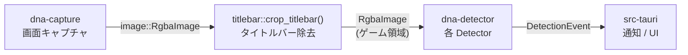
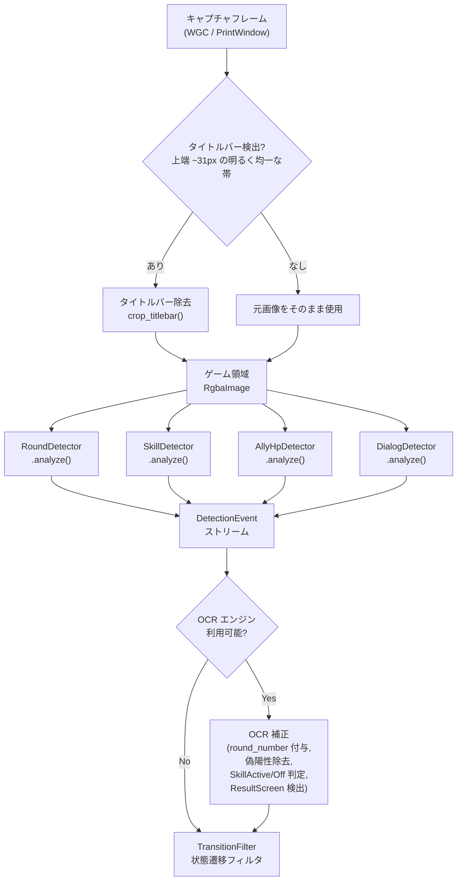
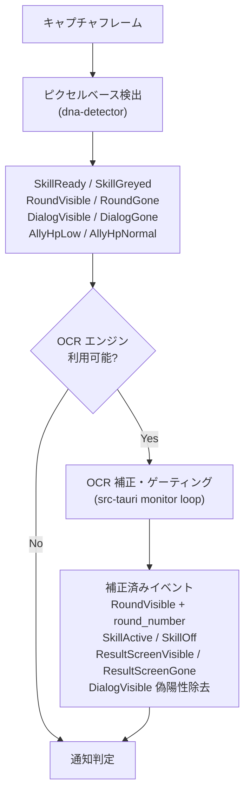

# 検出パイプライン概要

> 関連ドキュメント:
>
> - [RoundDetector](./round-detector.md)
> - [SkillDetector](./skill-detector.md)

## 1.1 背景

DNA Assistant は Duet Night Abyss のゲームプレイを監視し、AFK(放置)中のゲーム状態変化を Windows Toast 通知で報告するデスクトップアプリケーションである。

ゲーム画面のキャプチャフレームを解析し、ラウンド進行、スキル状態、味方 HP などの変化を検出する。検出ロジックはクレート分離により、プラットフォーム依存と非依存の責務を明確に分けている。

問題点:

- ピクセルベース検出は高速だが、テキスト読み取り(ラウンド番号、リザルト判定など)ができない
- Windows OCR API は `dna-capture` クレート(Windows 専用)に依存するため、`dna-detector` からは利用できない
- 検出精度とプラットフォーム移植性のバランスを取る必要がある

目標:

ピクセルベース検出(Phase 1)と OCR ベース検出(Phase 2)の責務分離を明確にし、段階的に検出精度を向上させる。

## 1.2 アーキテクチャ

### クレート構成

| クレート        | パス                   | プラットフォーム       | 責務                                                 |
| --------------- | ---------------------- | ---------------------- | ---------------------------------------------------- |
| `dna-detector`  | `crates/dna-detector/` | クロスプラットフォーム | ピクセルベース検出ロジック(ROI、色空間、各 Detector) |
| `dna-capture`   | `crates/dna-capture/`  | Windows 専用           | 画面キャプチャ(WGC, PrintWindow)、OCR(Phase 2)       |
| `dna-assistant` | `src-tauri/`           | Windows 専用           | Tauri v2 アプリ(IPC、通知、トレイ)                   |

### データフロー



### モジュール構成(`dna-detector`)

| モジュール          | 責務                                                       |
| ------------------- | ---------------------------------------------------------- |
| `detector::round`   | `RoundDetector` — ラウンドテキスト有無の検出               |
| `detector::skill`   | `SkillDetector` — Q スキル SP 枯渇の検出                   |
| `detector::ally_hp` | `AllyHpDetector` — 味方 HP 監視(スキャフォールディング)    |
| `detector::dialog`  | `DialogDetector` — ダイアログボックス(通信エラー等)の検出  |
| `state`             | `DebouncedDetector` — 一過性状態変化の抑制ラッパー         |
| `config`            | `DetectionConfig` — 全 Detector の設定型                   |
| `event`             | `DetectionEvent` — 検出イベント enum                       |
| `roi`               | `RoiDefinition` / `PixelRect` — 比率ベース ROI             |
| `color`             | `Hsv` / `HsvRange` / `rgb_to_hsv()` — 色空間ユーティリティ |
| `titlebar`          | `crop_titlebar()` — タイトルバー検出・除去                 |

## 1.3 検出パイプライン

### フレーム前処理

全ての Detector に共通する前処理として、タイトルバーの除去を行う。



### Detector 共通インターフェース

```rust
/// Trait for frame analyzers that produce detection events.
pub trait Detector {
    /// Analyze a single frame and return any detected events.
    fn analyze(&self, frame: &RgbaImage) -> Vec<DetectionEvent>;
}
```

全 Detector は `Detector` トレイトを実装し、`RgbaImage`(ゲーム領域)を入力、`Vec<DetectionEvent>` を出力とする。ROI の切り出しは各 Detector が `RoiDefinition::crop()` を使用して内部で行う。

### ROI(Region of Interest)

ROI は比率ベース(`0.0..=1.0`)で定義され、任意の解像度に自動スケーリングする。

```rust
pub struct RoiDefinition {
    pub x: f64,      // 左端比率
    pub y: f64,      // 上端比率
    pub width: f64,   // 幅比率
    pub height: f64,  // 高さ比率
}
```

ROI 切り出し失敗時(フレームサイズが極端に小さい場合)は空の `Vec` を返し、エラーにはしない。

## 1.4 実装済み Detector(Phase 1 — ピクセルベース)

### RoundDetector

> 詳細仕様: [round-detector.md](./round-detector.md)

| 項目     | 内容                                                                                                        |
| -------- | ----------------------------------------------------------------------------------------------------------- |
| 目的     | "探検 現在のラウンド：XX" テキストの有無を検出                                                              |
| 方式     | 高輝度(`>= 140`) + 低彩度(`< 60`)ピクセル密度 + 左端 1/4 最大輝度確認(`>= 200`)の 3 条件                    |
| ROI      | `x=0.0, y=0.256, w=0.250, h=0.035`                                                                          |
| イベント | `RoundVisible { round_number: Option<u32> }` / `RoundGone`                                                  |
| 用途     | ラウンド開始/終了の遷移検出。OCR 利用可能時は `round_number` にラウンド番号を付与                           |
| 制限     | ピクセル検出のみではラウンド番号の読み取り不可(OCR で補完)、リザルト画面と他の GONE 状態の区別は OCR で対応 |

### SkillDetector

> 詳細仕様: [skill-detector.md](./skill-detector.md)

| 項目     | 内容                                                                                                           |
| -------- | -------------------------------------------------------------------------------------------------------------- |
| 目的     | Q スキルアイコンの SP 枯渇によるグレーアウトを検出                                                             |
| 方式     | 最大輝度(`< 140`) AND ブライトピクセル比率(`< 5%`、閾値 `120`)の 2 条件                                        |
| ROI      | `x=0.878, y=0.880, w=0.042, h=0.038`                                                                           |
| イベント | `SkillReady` / `SkillGreyed` + OCR: `SkillActive` / `SkillOff`                                                 |
| 用途     | SP 枯渇(味方ダウン)の検出 — AFK モニタリングの主要トリガー                                                     |
| 制限     | ピクセル検出のみでは ON/OFF 区別不可。OCR 利用可能時に `SkillActive`(`"0"`) / `SkillOff`(SP コスト) を追加発行 |

### DialogDetector

| 項目     | 内容                                                                                |
| -------- | ----------------------------------------------------------------------------------- |
| 目的     | 中央ダイアログボックス(通信エラー "Tips" 等)の表示検出                              |
| 方式     | デュアル ROI: テキスト ROI の低彩度高輝度ピクセル密度 + 背景 ROI の暗色ピクセル密度 |
| ROI      | テキスト: `x=0.31, y=0.45, w=0.37, h=0.03` / 背景: `x=0.25, y=0.40, w=0.50, h=0.15` |
| イベント | `DialogVisible` / `DialogGone`                                                      |
| 用途     | 通信エラー等のダイアログ表示を検出し、手動対応を促す通知トリガー                    |
| 制限     | ダイアログ内テキストの読み取り不可(OCR 必要)、固定位置のダイアログのみ対応          |

### AllyHpDetector(スキャフォールディング)

| 項目       | 内容                                                                                |
| ---------- | ----------------------------------------------------------------------------------- |
| 目的       | 味方の HP が致命的に低下したことを検出                                              |
| 方式       | HSV 色空間で HP バー色(緑、`H: 80-150, S: 0.3-1.0, V: 0.3-1.0`)のピクセル比率を測定 |
| ROI        | `x=0.01, y=0.78, w=0.12, h=0.15`(プレースホルダー)                                  |
| イベント   | `AllyHpLow` / `AllyHpNormal`                                                        |
| ステータス | 実装済みだが実ゲームフレームでの検証未完了。設定値はプレースホルダー                |

### DebouncedDetector

| 項目       | 内容                                                                                                                                                                                                              |
| ---------- | ----------------------------------------------------------------------------------------------------------------------------------------------------------------------------------------------------------------- |
| 目的       | 一過性の状態変化(偽陽性)を抑制するラッパー                                                                                                                                                                        |
| 方式       | クールダウンベースのイベント抑制。前回イベントから `cooldown` 期間内のイベントを無視                                                                                                                              |
| API        | `DebouncedDetector::new(inner, cooldown)` / `process(&mut self, frame)` / `reset()`                                                                                                                               |
| ステータス | ライブラリとして利用可能だが、現在のモニターループでは使用していない。偽陽性抑制は `TransitionFilter`(状態遷移フィルタ)+ `NotificationManager`(持続時間判定)+ `round_transition_suppress`(ラウンド遷移抑制)で対応 |

## 1.5 OCR ベース検出(`dna-capture` — 実装済み)

Windows OCR API(`Windows.Media.Ocr`、日本語)を `dna-capture::ocr::JapaneseOcrEngine` で初期化し、ピクセルベースでは不可能なテキスト認識を行う。OCR エンジンはモニタースレッド起動時に 1 回初期化され、日本語パックが未インストールの場合はピクセル検出のみにフォールバックする。



### OCR 補正ロジック(実装済み)

モニターループの `run_ocr()` がピクセル検出結果に基づいて条件付きで OCR を実行する。

| トリガー        | OCR ROI                                    | 処理                                                                                     | ステータス |
| --------------- | ------------------------------------------ | ---------------------------------------------------------------------------------------- | ---------- |
| `RoundVisible`  | `x=0.0, y=0.22, w=0.30, h=0.10` (拡大 ROI) | "ラウンド" テキスト確認 → `round_number` 付与。未検出時は `RoundGone` に置換(偽陽性除去) | 実装済み   |
| `RoundGone`     | `x=0.0, y=0.75, w=0.35, h=0.20`            | "依頼完了" テキスト検出 → `ResultScreenVisible` 追加発行                                 | 実装済み   |
| `SkillReady`    | `x=0.85, y=0.86, w=0.10, h=0.10`           | SP コスト数字を解析。`"0"` → `SkillActive`、それ以外 → `SkillOff` を追加発行             | 実装済み   |
| `DialogVisible` | `x=0.25, y=0.35, w=0.50, h=0.20`           | "Tips" テキスト確認。未検出時は `DialogGone` に置換(偽陽性除去)                          | 実装済み   |

### OCR 検出対象(未実装)

| 機能         | OCR 対象テキスト                                               | 目的                          | 優先度 |
| ------------ | -------------------------------------------------------------- | ----------------------------- | ------ |
| 自動周回状態 | "**自動周回中 (X/5)**、カウントダウン終了後に自動で続行します" | 自動周回進行の追跡            | 中     |
| 自動周回終了 | "**自動周回が終了しました**"                                   | 自動周回完了の検出            | 中     |
| SP バー値    | `"397"` 等の数値                                               | SP レベル追跡(枯渇の事前警告) | 低     |

### ピクセル検出と OCR の責務境界

| 検出対象             | ピクセル検出                | OCR 補正                                          | ステータス |
| -------------------- | --------------------------- | ------------------------------------------------- | ---------- |
| ラウンドテキスト有無 | `RoundDetector` で検出      | "ラウンド" 未検出時に偽陽性除去                   | 実装済み   |
| ラウンド番号         | 検出不可                    | OCR で数値抽出 → `round_number` に付与            | 実装済み   |
| リザルト画面         | `RoundGone` で推定(不確定)  | "依頼完了" テキストで確定 → `ResultScreenVisible` | 実装済み   |
| Q スキル SP 枯渇     | `SkillDetector` で検出      | —                                                 | 実装済み   |
| Q スキル ON/OFF      | 検出不可(輝度同一)          | SP コスト数字で判別 → `SkillActive` / `SkillOff`  | 実装済み   |
| ダイアログ表示       | `DialogDetector` で検出     | "Tips" 未検出時に偽陽性除去                       | 実装済み   |
| 自動周回状態         | 検出不可                    | OCR でテキスト認識(未実装)                        | 未実装     |
| 味方 HP              | `AllyHpDetector` で検出予定 | —                                                 | 未検証     |

## 1.6 通知戦略(`src-tauri` — 実装済み)

| トリガー         | 条件                            | 持続時間 | 優先度                      | 検出元                |
| ---------------- | ------------------------------- | -------- | --------------------------- | --------------------- |
| Q スキル SP 枯渇 | `SkillGreyed` が持続            | 5 秒     | **高** — 味方ダウンの可能性 | ピクセル              |
| ダイアログ表示   | `DialogVisible` が持続          | 3 秒     | **高** — 手動対応が必要     | ピクセル + OCR ゲート |
| ラウンド完了     | `RoundGone` が持続              | 5 秒     | 中 — 情報通知               | ピクセル              |
| 依頼完了(OCR)    | `ResultScreenVisible`           | 0 秒     | 中 — 確定的検出             | OCR                   |
| 味方 HP 低下     | `AllyHpLow` が持続              | 10 秒    | 低 — 自己回復の可能性あり   | ピクセル              |
| 自動周回終了     | OCR: `"自動周回が終了しました"` | —        | 中 — 手動再開が必要         | 未実装                |

## 1.7 イベント型

### `DetectionEvent` enum

```rust
pub enum DetectionEvent {
    // Skill detector (pixel-based)
    SkillReady { icon_bright_ratio: f64, max_brightness: u8, timestamp: Instant },
    SkillGreyed { icon_bright_ratio: f64, max_brightness: u8, timestamp: Instant },
    // Skill detector (OCR-enriched, added by monitor loop)
    SkillActive { sp_cost: String, timestamp: Instant },
    SkillOff { sp_cost: String, timestamp: Instant },
    // Ally HP detector (pixel-based)
    AllyHpLow { ally_index: u8, hp_ratio: f64, timestamp: Instant },
    AllyHpNormal { ally_index: u8, hp_ratio: f64, timestamp: Instant },
    // Round detector (pixel-based, OCR-enriched round_number)
    RoundVisible { text_present: bool, white_ratio: f64, round_number: Option<u32>, timestamp: Instant },
    RoundGone { white_ratio: f64, timestamp: Instant },
    // Result screen (OCR-only, added by monitor loop)
    ResultScreenVisible { text: String, timestamp: Instant },
    ResultScreenGone { timestamp: Instant },
    // Dialog detector (pixel-based, OCR-gated)
    DialogVisible { text_ratio: f64, bg_dark_ratio: f64, timestamp: Instant },
    DialogGone { text_ratio: f64, bg_dark_ratio: f64, timestamp: Instant },
}
```

全イベントに `timestamp: Instant` を含み、`TransitionFilter` や通知判定で時間ベースのフィルタリングに使用する。

## 1.8 検証済み環境

### 解像度

| キャプチャ          | ゲーム領域  | Round ROI | Skill ROI | ステータス         |
| ------------------- | ----------- | --------- | --------- | ------------------ |
| FHD `1922x1112`     | `1922x1081` | `480x37`  | `80x41`   | OK                 |
| 1600x900 `1602x932` | `1602x901`  | `400x31`  | `67x34`   | OK                 |
| 720p `1282x752`     | `1282x721`  | `320x25`  | `53x27`   | OK                 |
| 下限 約 `960x540`   | —           | —         | —         | テキスト検出不安定 |

### ビジュアルフィルター

Professional、NORMAL、CINEMATIQ の 3 フィルター全てで正常動作を確認済み。

## 1.9 テストカバレッジ

| コンポーネント      | ユニットテスト            | インテグレーションテスト                                     | フィクスチャ |
| ------------------- | ------------------------- | ------------------------------------------------------------ | ------------ |
| `RoundDetector`     | 5 件                      | 15 件(3 フィルター x FHD + 720p パイプライン)                | 16 画像      |
| `SkillDetector`     | 5 件                      | 15 件(4 動画 + FHD パイプライン)                             | 15 画像      |
| `titlebar`          | 7 件                      | (パイプラインテストでカバー)                                 | —            |
| `AllyHpDetector`    | 2 件                      | —                                                            | —            |
| `DialogDetector`    | 6 件                      | 4 件(通信エラー + 1368x800 全画面 + リザルト + ゲームプレイ) | 4 画像       |
| `DebouncedDetector` | 4 件                      | —                                                            | —            |
| `config`            | 1 件                      | —                                                            | —            |
| `roi`               | 4 件                      | —                                                            | —            |
| `color`             | 7 件                      | —                                                            | —            |
| 合計                | 41 件 + 34 件 = 75 テスト |                                                              |              |

## 1.10 エラーハンドリング・フォールバック


- タイトルバー未検出時: 元画像をクローンして返す(ボーダーレス/フルスクリーンで安全)
- ROI 切り出し失敗時: 空の `Vec` を返し、エラーにはしない(フレームサイズが極端に小さい場合)
- ピクセル数 `0` の場合: 各比率は `0.0` を返す(ゼロ除算なし)
- `DebouncedDetector`: 内部 Detector がイベントを返さない場合、そのまま空の `Vec` を透過

## 1.11 検討事項

- [x] `DebouncedDetector` のユニットテスト追加(4 件追加済み)
- [x] Phase 2 OCR 検出の `dna-capture` 側インターフェース設計 — `JapaneseOcrEngine` 実装済み
- [x] `DetectionEvent` の OCR 拡張 — `SkillActive`, `SkillOff`, `ResultScreenVisible`, `ResultScreenGone`, `RoundVisible::round_number` 追加済み
- [x] 通知判定ロジック(`src-tauri` 側)の設計 — `NotificationManager` + `TransitionFilter` 実装済み
- [ ] `AllyHpDetector` の実ゲームフレームによる検証と設定値の調整
- [ ] 複数 Detector の並列実行最適化(現在は逐次処理前提)
- [ ] 自動周回状態の OCR 検出(未実装)
- [ ] SP バー値の OCR 監視(未実装)
