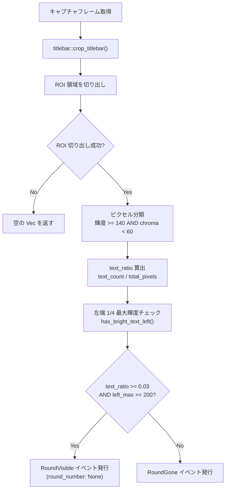
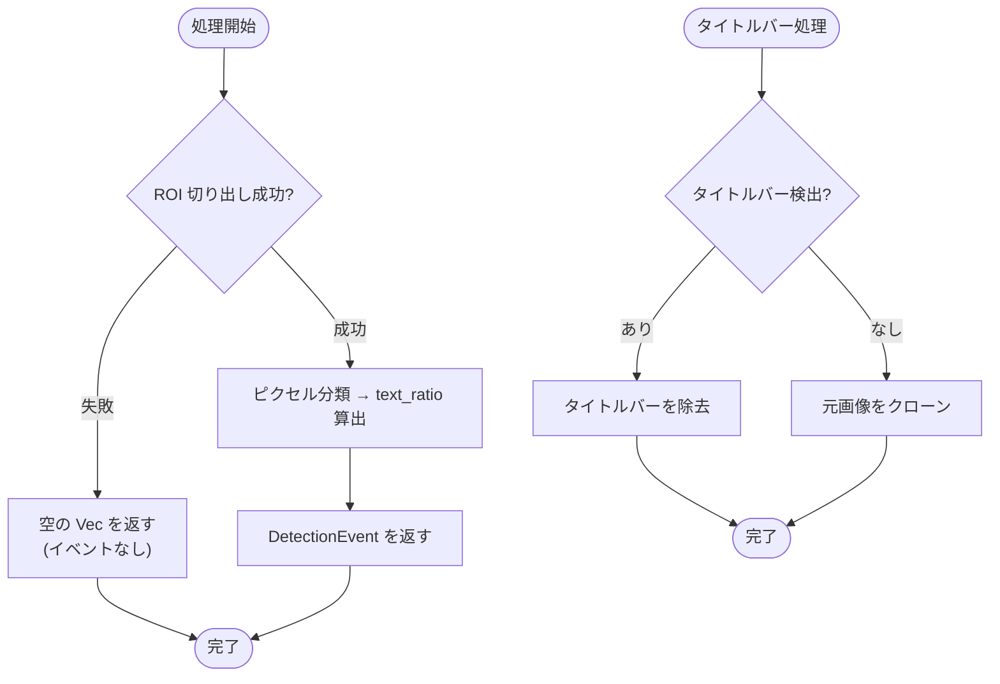

# RoundDetector

> 親ドキュメント: [IMPROVEMENT_PLAN.md](../IMPROVEMENT_PLAN.md)

## 1.1 背景

Duet Night Abyss の探検モードでは、画面左上に "探検 現在のラウンド：XX" というラウンド表示テキストが常時表示される。このテキストが消えるタイミング(リザルト画面、カットシーン、ラウンド終了など)を検知することで、ゲーム状態の遷移を把握できる。

問題点:

- 戦闘エフェクト(雷、炎など)も高輝度ピクセルを生成するため、単純な輝度閾値だけではテキストとエフェクトを区別できない
- ウィンドウキャプチャ(WGC, PrintWindow)は Windows タイトルバー(約 `31px`)を含むため、ROI 座標がずれる
- 解像度やビジュアルフィルター設定によってテキストの見え方が変わる

目標:

高輝度かつ低彩度(low chroma)のピクセル密度を測定することで、戦闘エフェクトの影響を受けずにラウンドテキストの有無を安定検知する。

## 1.2 検出方式

### ピクセル分類ロジック

テキストピクセルの判定条件:

| 条件         | 計算式                        | 閾値                        |
| ------------ | ----------------------------- | --------------------------- |
| 平均輝度     | `(R + G + B) / 3`             | `>= 140` (`brightness_min`) |
| 彩度(chroma) | `max(R, G, B) - min(R, G, B)` | `< 60` (`max_chroma`)       |

chroma フィルターが重要な役割を果たす。ラウンドテキストはニュートラルな白/灰色であるため低彩度だが、戦闘エフェクト(雷、炎)は高輝度であっても高彩度になる。この差異を利用して分離する。

### 左端テキスト確認

ROI 左端 1/4 領域の最大輝度を計測し、`text_left_brightness_min`(`200`)以上であることを追加条件とする。ラウンドテキスト "探検" は常に左端から白文字(輝度 `~255`)で始まるが、リザルト画面等の背景は左端が暗い(`~168` 以下)ため、この条件で分離できる。

### 判定閾値

3 条件の AND で `RoundVisible` を判定する:

| 指標                        | 閾値                             | 意味                                 |
| --------------------------- | -------------------------------- | ------------------------------------ |
| `text_ratio`                | `>= 0.03` (3%)                   | テキストピクセル密度が十分           |
| `has_bright_text_left`      | ROI 左端 1/4 の最大輝度 `>= 200` | 左端に白いテキスト("探検")が存在する |
| 上記の AND 条件を満たさない | —                                | テキスト消失(`RoundGone`)            |

`text_left_brightness_min` は、リザルト画面のような全体的に明るいが左端が暗い背景を排除するためのガード条件である。リザルト画面の左端最大輝度は `~168` であり、閾値 `200` で分離される。

実測値: テキスト表示時は `text_ratio >= 4.5%`、消失時は `<= 1.1%`。 `3%` の閾値でクリーンに分離される。

### ROI 定義

| パラメータ | 値      | 説明           |
| ---------- | ------- | -------------- |
| `x`        | `0.0`   | 左端からの比率 |
| `y`        | `0.256` | 上端からの比率 |
| `width`    | `0.250` | 幅の比率       |
| `height`   | `0.035` | 高さの比率     |

ゲーム画面左上のラウンド表示テキスト領域を対象とする。

## 1.3 処理フロー



パイプライン:

```
capture frame → crop_titlebar() → detector.analyze(&game_area) → DetectionEvent
```

## 1.4 タイトルバー処理

`titlebar` モジュールがウィンドウキャプチャに含まれる Windows タイトルバーを検出・除去する。

### 検出アルゴリズム

フレーム上端から最大 `50` 行を走査し、以下の条件を満たす連続帯をタイトルバーと判定:

| 条件     | 内容                                           |
| -------- | ---------------------------------------------- |
| 輝度     | 左/中央/右の各 1/3 領域の平均輝度 `> 150`      |
| 均一性   | 3 領域の平均輝度の差(spread) `< 40`            |
| 開始位置 | 行 `0` ~ `3` 以内に開始(ボーダー/シャドウ許容) |
| 連続性   | 途切れた時点でタイトルバー終了                 |

### 動作パターン

| キャプチャ方式                | タイトルバー    | `detect_titlebar_height()` の戻り値 |
| ----------------------------- | --------------- | ----------------------------------- |
| WGC / PrintWindow             | あり(約 `31px`) | `31`                                |
| ボーダーレス / フルスクリーン | なし            | `0`                                 |
| クライアント領域のみ(将来)    | なし            | `0`                                 |

`crop_titlebar()` はタイトルバーが検出されない場合、元画像をクローンして返すため、ボーダーレス/フルスクリーンでも安全に使用できる。

## 1.5 データ仕様

### Rust 型定義

```rust
/// Configuration for the round completion detector.
#[derive(Debug, Clone, PartialEq, Serialize, Deserialize)]
pub struct RoundDetectorConfig {
    /// ROI for the round text area.
    pub roi: RoiDefinition,
    /// Minimum text pixel ratio to consider text present (e.g., 0.03).
    pub text_presence_threshold: f64,
    /// Minimum average brightness (0-255) for a pixel to be a text candidate.
    pub brightness_min: u8,
    /// Maximum chroma (max(R,G,B) - min(R,G,B)) to filter out colorful combat effects.
    pub max_chroma: u8,
    /// Minimum max brightness in the left quarter of the ROI to confirm text presence.
    /// Round text "探検" starts from the left with white characters (~255).
    /// Result screen backgrounds never reach this brightness in the left area (~168 max).
    pub text_left_brightness_min: u8,
}
```

### デフォルト設定値

```rust
RoundDetectorConfig {
    roi: RoiDefinition { x: 0.0, y: 0.256, width: 0.250, height: 0.035 },
    text_presence_threshold: 0.03,
    brightness_min: 140,
    max_chroma: 60,
    text_left_brightness_min: 200,
}
```

### 発行イベント

| イベント                       | フィールド                                                                                  | 説明                                                               |
| ------------------------------ | ------------------------------------------------------------------------------------------- | ------------------------------------------------------------------ |
| `DetectionEvent::RoundVisible` | `text_present: bool`, `white_ratio: f64`, `round_number: Option<u32>`, `timestamp: Instant` | テキスト検出(ラウンド進行中)。OCR 利用可能時は `round_number` 付与 |
| `DetectionEvent::RoundGone`    | `white_ratio: f64`, `timestamp: Instant`                                                    | テキスト消失(リザルト画面、カットシーン、ラウンド終了)             |

## 1.6 検証済み解像度

| キャプチャ | 実サイズ    | タイトルバー | ゲーム領域  | ROI サイズ | ステータス |
| ---------- | ----------- | ------------ | ----------- | ---------- | ---------- |
| FHD        | `1922x1112` | `31px`       | `1922x1081` | `449x29`   | OK         |
| 1600x900   | `1602x932`  | `31px`       | `1602x901`  | `374x24`   | OK         |
| 720p       | `1282x752`  | `31px`       | `1282x721`  | `299x19`   | OK         |

下限: 約 `960x540` (qHD)。これ以下ではテキストピクセルが小さすぎて信頼性のある検出ができない。

### ビジュアルフィルター対応

| フィルター   | 特性                               | テキスト表示時 `text_ratio` | テキスト消失時 `text_ratio` |
| ------------ | ---------------------------------- | --------------------------- | --------------------------- |
| NORMAL       | 標準カラー                         | `>= 4.5%`                   | `<= 1.1%`                   |
| CINEMATIQ    | カラーグレーディング、やや彩度低下 | `>= 4.5%`                   | `<= 1.1%`                   |
| Professional | 高輝度、エフェクト彩度強め         | `>= 4.5%`                   | `<= 1.1%`                   |

3 フィルターとも `3%` 閾値でクリーンに分離される。

## 1.7 テストカバレッジ

### ユニットテスト(`round.rs` 内)

| テスト                                       | 検証内容                                                          |
| -------------------------------------------- | ----------------------------------------------------------------- |
| `white_text_detected_as_visible`             | ニュートラル白ピクセル → `RoundVisible`                           |
| `dark_screen_detected_as_gone`               | 暗い画面 → `RoundGone`                                            |
| `bright_colorful_pixels_not_counted_as_text` | 高彩度の明るいピクセル(マゼンタ) → テキストとしてカウントされない |
| `text_ratio_calculation`                     | `text_ratio` の数値精度検証                                       |
| `mixed_text_and_effects_only_counts_text`    | テキスト + 戦闘エフェクト混在時、テキストのみカウント             |

### インテグレーションテスト(`round_detector_test.rs`)

| カテゴリ                | テスト数 | 内容                                                           |
| ----------------------- | -------- | -------------------------------------------------------------- |
| FHD ROI フィクスチャ    | 10 件    | 3 フィルター x 複数シーン(戦闘中、リザルト、カットシーン)      |
| 720p ROI フィクスチャ   | 3 件     | テキスト表示/消失の検証                                        |
| 720p パイプラインテスト | 2 件     | タイトルバー付きフルフレーム → `crop_titlebar()` → `analyze()` |

フィクスチャは実際のゲームプレイから取得。3 種のビジュアルフィルター、4 つの動画ソースをカバー。

## 1.8 エラーハンドリング・フォールバック



- ROI 切り出し失敗時(フレームサイズが極端に小さい場合など): 空の `Vec` を返し、エラーにはしない
- タイトルバー未検出時: 元画像をそのまま使用(安全なフォールバック)
- `total` ピクセル数が `0` の場合: `text_ratio` は `0.0` を返す

## 1.9 既知の制限事項

- 極端な雷エフェクトが `text_ratio` を膨張させる場合がある(例: 1 フレームで `48%`)。白い雷は低彩度のため。 `DebouncedDetector` がこれらのスパイクを吸収する
- `960x540` 未満ではテキストが圧縮されすぎて信頼性のある検出ができない
- タイトルバー検出は Windows スタイルの明るく均一な上端帯を前提としている。Windows 以外のキャプチャやカスタムウィンドウデコレーションは検出されない可能性がある

## 1.10 検討事項

- [x] OCR ベースのラウンド番号抽出 — `run_ocr()` で `round_number` を `RoundVisible` に付与。OCR で "ラウンド" テキスト未検出時は偽陽性として `RoundGone` に置換
- [ ] `dna-capture` がクライアント領域のみのフレーム(`GetClientRect`)を提供する場合、タイトルバー検出は不要になるが、無害(`0` を返す)
- [ ] `DebouncedDetector` との統合仕様の詳細化(スパイク耐性の定量評価)
