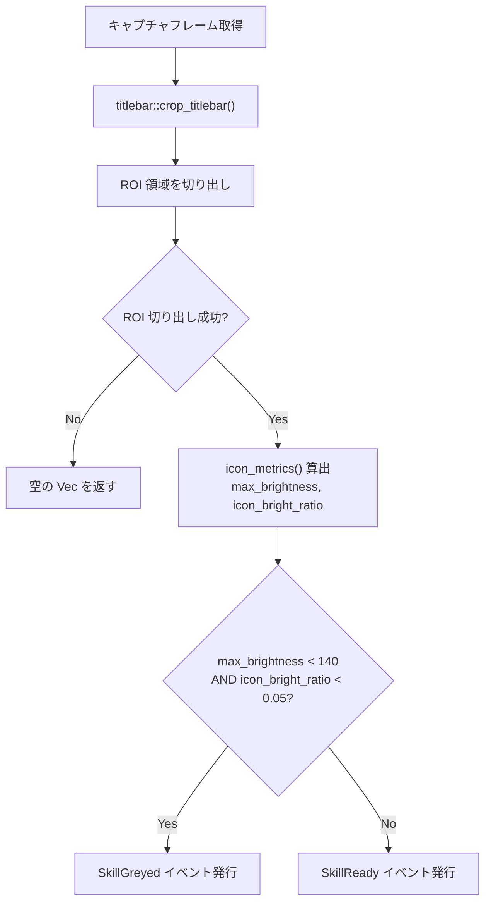
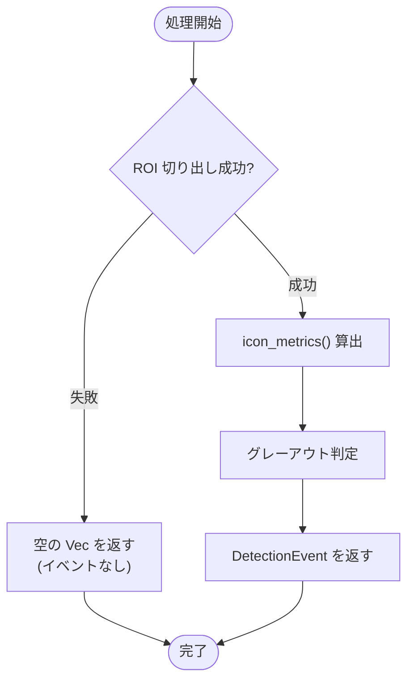

# SkillDetector

> 親ドキュメント: [IMPROVEMENT_PLAN.md](../IMPROVEMENT_PLAN.md)
>
> 関連ドキュメント:
>
> - [RoundDetector](./round-detector.md)

## 1.1 背景

Duet Night Abyss では、Q スキル("強化")は SP(スタミナポイント)を毎秒消費する持続/トグル型スキルである(例: `6 SP/s`、装備により変動)。パーティメンバーが SP 回復を提供することで、通常は SP が安定的に維持される。

しかし、味方がダウンすると SP 回復が停止し、SP が枯渇してスキルが強制解除される。このとき Q スキルのアイコンがグレーアウトする。これが AFK モニタリングにおける主要な通知トリガーである。

問題点:

- Q スキルアイコンは ON/OFF/SP 枯渇の 3 状態を持つが、ON と OFF の区別には OCR が必要(数字 `"0"` vs `"6"` は約 `9x13px` と微小)
- スキル演出(カットインアニメーション)中は UI 全体が消失し、ROI にゲーム背景が写り込むことで偽陽性が発生する
- ウィンドウキャプチャは Windows タイトルバーを含むため、ROI 座標にオフセットが必要

目標:

アイコン領域の最大輝度とブライトピクセル比率の 2 条件で、SP 枯渇によるグレーアウトを安定検知する。ON/OFF の区別は将来の OCR(Phase 2)に委譲し、`SkillDetector` は READY/GREYED の 2 状態のみを出力する。

## 1.2 ゲームメカニクスコンテキスト

### Q スキルの 3 状態(ユーザー視点)

| 状態        | Q アイコン       | SP 数字        | 意味                   |
| ----------- | ---------------- | -------------- | ---------------------- |
| ON          | 明るく表示       | `0`            | スキル持続中(通常)     |
| SP_DEPLETED | **グレーアウト** | `6`(SP コスト) | SP 枯渇 → **通知対象** |
| OFF         | 明るく表示       | `6`(SP コスト) | スキル未使用(手動 OFF) |

### SP 枯渇のメカニズム

```
味方ダウン → SP 回復停止 → SP 枯渇 → Q スキル強制解除 → アイコン グレーアウト
                                            ↓
味方復活 / アイテム取得 → SP 回復再開 → SP 回復 → アイコン復帰
```

スキルには約 `2` 秒のクールダウンがあるため、SP 回復後すぐには再発動されない。

## 1.3 検出方式

### ピクセル分類ロジック

ブライトピクセルの判定条件:

| 条件     | 計算式            | 閾値                             |
| -------- | ----------------- | -------------------------------- |
| 平均輝度 | `(R + G + B) / 3` | `>= 120` (`icon_brightness_min`) |

### グレーアウト判定

2 条件の AND で判定する:

| 指標                | 閾値                                    | 意味                               |
| ------------------- | --------------------------------------- | ---------------------------------- |
| `max_brightness`    | `< 140` (`greyed_max_brightness`)       | ROI 内の最大輝度が低い             |
| `icon_bright_ratio` | `< 0.05` (5%) (`icon_bright_threshold`) | ブライトピクセルの割合が極めて低い |

両条件を満たす → `SkillGreyed`、それ以外 → `SkillReady`。

### ピクセル分布データ

| 状態                 | MaxBr 範囲        | Icon% 範囲 | 分離度             |
| -------------------- | ----------------- | ---------- | ------------------ |
| GREYED(SP 枯渇)      | `76-126`          | `0%`       | 明確               |
| READY(ON または OFF) | `245-255`         | `23-37%`   | 明確               |
| ギャップ             | 約 `119` ポイント | 約 `23%`   | 非常に信頼性が高い |

GREYED と READY の間に約 `119` ポイントのギャップがあり、閾値 `140` はこの中間に位置する。誤判定のリスクは極めて低い。

### ROI 定義

| パラメータ | 値      | 説明           |
| ---------- | ------- | -------------- |
| `x`        | `0.878` | 左端からの比率 |
| `y`        | `0.880` | 上端からの比率 |
| `width`    | `0.042` | 幅の比率       |
| `height`   | `0.038` | 高さの比率     |

ゲーム画面右下の Q スキルアイコン領域(SP 数字やラベルテキストを除外)を対象とする。

## 1.4 処理フロー



パイプライン:

```
capture frame → crop_titlebar() → detector.analyze(&game_area) → DetectionEvent
```

## 1.5 データ仕様

### Rust 型定義

```rust
/// Configuration for the skill (Q) SP depletion detector.
#[derive(Debug, Clone, PartialEq, Serialize, Deserialize)]
pub struct SkillDetectorConfig {
    /// ROI for the Q skill icon area (excluding SP number and label text).
    pub roi: RoiDefinition,
    /// Maximum brightness below which the icon is considered greyed out.
    pub greyed_max_brightness: u8,
    /// Minimum ratio of bright pixels for the icon to be considered active.
    pub icon_bright_threshold: f64,
    /// Minimum brightness for a pixel to count as part of the visible icon.
    pub icon_brightness_min: u8,
}
```

### デフォルト設定値

```rust
SkillDetectorConfig {
    roi: RoiDefinition { x: 0.878, y: 0.880, width: 0.042, height: 0.038 },
    greyed_max_brightness: 140,
    icon_bright_threshold: 0.05,
    icon_brightness_min: 120,
}
```

### 発行イベント

| イベント                      | フィールド                                                           | 説明                           |
| ----------------------------- | -------------------------------------------------------------------- | ------------------------------ |
| `DetectionEvent::SkillReady`  | `icon_bright_ratio: f64`, `max_brightness: u8`, `timestamp: Instant` | アイコン表示(ON または OFF)    |
| `DetectionEvent::SkillGreyed` | `icon_bright_ratio: f64`, `max_brightness: u8`, `timestamp: Instant` | アイコン グレーアウト(SP 枯渇) |

## 1.6 検証済み動画

| 動画      | 時間   | SP 枯渇区間                                        | 検出結果                                                             |
| --------- | ------ | -------------------------------------------------- | -------------------------------------------------------------------- |
| `skill_1` | `91s`  | なし                                               | 全フレーム READY — 正常                                              |
| `skill_2` | `91s`  | なし                                               | 全フレーム READY — 正常(カットイン演出は `DebouncedDetector` で除外) |
| `skill_3` | `39s`  | なし                                               | 全フレーム READY — 正常                                              |
| `skill_4` | `116s` | `t49-52`                                           | GREYED 検出 — 正常                                                   |
| `skill_5` | `52s`  | `t15-27`(長時間)                                   | GREYED 検出 — 正常、閾値 `140` で安定                                |
| `skill_6` | `89s`  | `t13-20`, `t38-42`, `t67`, `t74-75`, `t86`(複数回) | GREYED 検出 — 正常                                                   |

全動画は Professional フィルター、FHD (`1922x1112`)。

## 1.7 テストカバレッジ

### ユニットテスト(`skill.rs` 内)

| テスト                          | 検証内容                                                                                             |
| ------------------------------- | ---------------------------------------------------------------------------------------------------- |
| `bright_icon_detected_as_ready` | 30% ブライトピクセル(白 `220`)を含む画像 → `SkillReady`                                              |
| `dark_icon_detected_as_greyed`  | 全ピクセル暗い(`30`)画像 → `SkillGreyed`                                                             |
| `icon_metrics_all_black`        | 全黒画像 → `ratio = 0.0`, `max_br = 0`                                                               |
| `icon_metrics_mixed_brightness` | 20% ブライト / 80% ダーク → `ratio ≈ 0.2`, `max_br = 200`                                            |
| `greyed_threshold_boundary`     | `max_brightness = 120`(閾値 `140` 未満だが `icon_bright_ratio = 100%`)→ `SkillReady`(AND 条件のため) |

### インテグレーションテスト(`skill_detector_test.rs`)

| カテゴリ                | テスト数 | フィクスチャ                                                                                                    |
| ----------------------- | -------- | --------------------------------------------------------------------------------------------------------------- |
| READY ON(スキル持続中)  | 5 件     | `ready_on_s1_f60`, `ready_on_s1_f70`, `ready_on_s1_f85`(暗い背景), `ready_on_s2_f10`, `ready_on_s3_f20`(探検中) |
| READY OFF(スキル未使用) | 3 件     | `ready_off_s1_f28`, `ready_on_s4_t45`(枯渇前), `ready_off_s4_t55`(回復後)                                       |
| GREYED(SP 枯渇)         | 4 件     | `greyed_s4_t49`, `greyed_s4_t50`, `greyed_s4_t51`, `greyed_s4_t52`                                              |

フィクスチャは実際のゲームプレイ動画 4 本から切り出した `80x41` RGBA の ROI 画像。

## 1.8 既知の問題: カットインアニメーションの偽陽性

スキル発動時のカットインアニメーション(約 `0.2-0.4s`)中に UI 全体が消失する。ROI にはゲーム背景が写り込み、`max_brightness` が低くなるため、偽 GREYED イベントが発生する。

| 特性     | カットイン偽陽性 | 実際の SP 枯渇 |
| -------- | ---------------- | -------------- |
| 持続時間 | `0.2-0.4s`       | `10s` 以上     |
| パターン | 単発スパイク     | 持続的         |

対策: モニターループでは `TransitionFilter` が状態遷移のみを UI に転送し、`NotificationManager` が持続時間判定(5 秒)で一過性のスパイクを除外する。実際の SP 枯渇は `10` 秒以上持続するため、持続時間判定で抑制されることはない。また `RoundGone` 後 15 秒間は `round_transition_suppress` でスキルイベントを完全に抑制し、画面遷移時の偽陽性を防ぐ。

## 1.9 エラーハンドリング・フォールバック



- ROI 切り出し失敗時(フレームサイズが極端に小さい場合など): 空の `Vec` を返し、エラーにはしない
- `total` ピクセル数が `0` の場合: `icon_bright_ratio` は `0.0`、`max_brightness` は `0` を返す
- `icon_metrics()` は `#[must_use]` で戻り値の無視を防止

## 1.10 検討事項

- [x] ON vs OFF の区別 — OCR で SP コスト数字を読み取り、`SkillActive`(`"0"`) / `SkillOff`(SP コスト) を追加発行。`run_ocr()` で実装済み
- [ ] SP バー監視による枯渇の事前警告(枯渇前に通知する仕組み)
- [ ] 異なるキャラクターの SP コスト(`6`, `10` など)への対応 — 現在の実装はグレーアウト検出のため、SP 数値に依存せずキャラクター非依存
